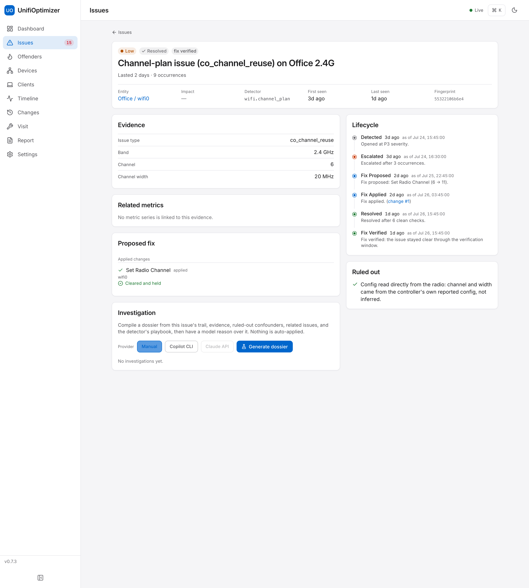
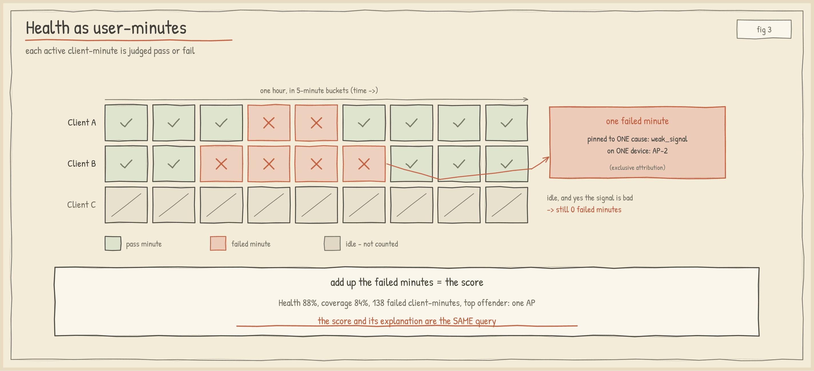
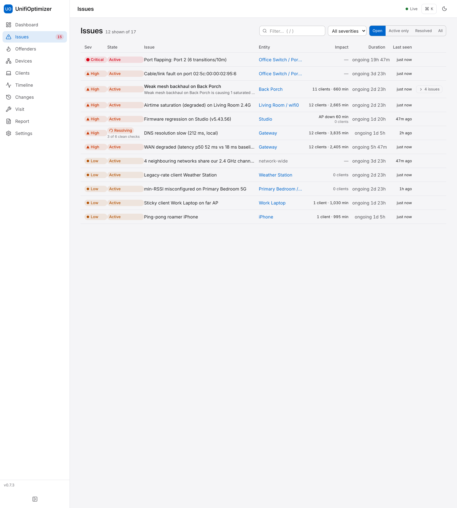
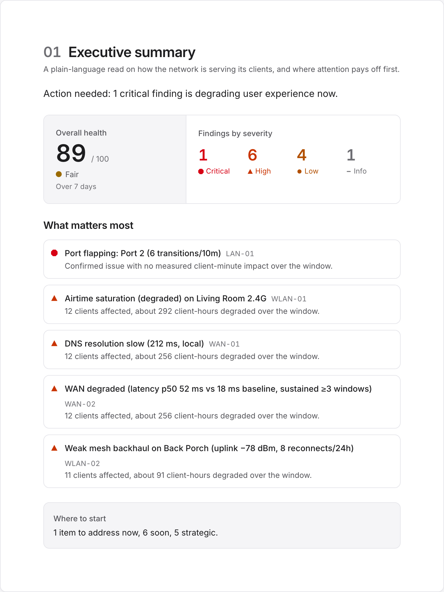
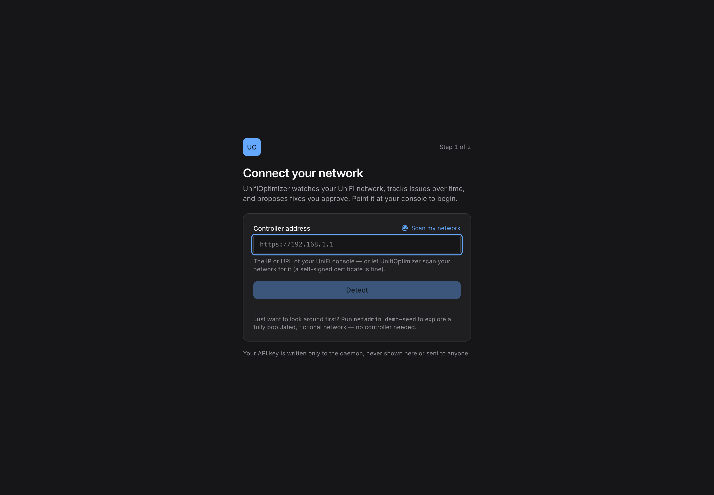

# UnifiOptimizer

**The incident engine for UniFi.** A UniFi controller discards its fine-grained
stats after about a day. UnifiOptimizer keeps that history and turns it into tracked
issues: it notices when something starts misbehaving, rules out the obvious false
alarms, names the root cause, scores how much your users actually felt it, and
proposes a fix you approve and can revert in one click.

Ask it "when did this start" and it answers, because it was watching.

One `pip install`, one Python process, MIT licensed.


Every issue carries its whole history: when it was first detected, when it got worse,
what was ruled out, the fix that was applied, and whether it held.



## Quick start

```bash
pip install unifioptimizer

# see it working on a fictional, PII-free demo network (no controller needed)
netadmin demo-seed --out data/netadmin-demo.db --now $(( $(date +%s) / 300 * 300 ))
NETADMIN_DB_PATH=data/netadmin-demo.db netadmin daemon   # then open http://localhost:8765

# or point it at your own controller: put credentials in data/secrets.env (below)
netadmin daemon
```

The wheel bundles the compiled dashboard, so `pip install` alone gives you a
working UI with no Node.js. Running from a source checkout instead? See
[Install](#install), which needs one build step.

---

## Why UnifiOptimizer

UniFi tooling mostly comes in three shapes, and all three are useful:

- **Metrics pipelines** like [unpoller](https://github.com/unpoller/unpoller) remember
  everything and interpret nothing. You get raw series in InfluxDB or Prometheus, a
  Grafana stack to run, and you supply the meaning.
- **Live-query tools** (the controller's own views, the UniFi MCP servers, WiFiman)
  interpret the present well but inherit the controller's amnesia. They cannot tell you
  when something started, because that data is already gone.
- **Snapshot reporters** run once and print a picture of right now.

UnifiOptimizer is the fourth shape: it keeps the history *and* attaches meaning to it.

- **33 detectors** across wifi, wired, WAN, client, network and infrastructure, each with
  confounder checks so a busy AP is not reported as a broken one.
- **One issue per fingerprint**, not a new alert every poll. Issues move through pending,
  active, resolving and resolved, and reopen if the fault refires.
- **Root cause, not a wall of alarms.** Correlation groups a cause with its symptoms, so a
  failing mesh uplink reads as one incident instead of six unrelated complaints.
- **Health you can argue with.** Every score traces to failed client-minutes attributed to
  exactly one cause on one device, so "84/100" always has a receipt. A device's own downtime
  is tracked separately and never added to that total, because minutes a box spent dark are
  not minutes a person spent waiting.
- **Fixes you approve.** Dry-run by default, before/after snapshots, one-click revert.
- **Bring your own model.** The investigator compiles a dossier you can hand to any LLM, or
  run through the Copilot CLI or the Anthropic API. No API key required to use the tool.

Where the others are ahead, plainly: [NetworkOptimizer](https://github.com/Ozark-Connect/NetworkOptimizer)
covers far more ground (security auditing, RF heatmaps, SNMP, multi-site, WAN steering);
[unpoller](https://github.com/unpoller/unpoller) is the better raw metrics pipeline; and
[UI Toolkit](https://github.com/Crosstalk-Solutions/unifi-toolkit) has per-device Wi-Fi
tracking and IDS views. They solve different problems, and running more than one is
reasonable. [`docs/COMPARISON.md`](docs/COMPARISON.md) is the full side-by-side,
including what this project deliberately will not do.

Architecture and design decisions are documented in full at
[`docs/ARCHITECTURE.md`](docs/ARCHITECTURE.md), with a plain-language walkthrough at
[`docs/HOW_IT_WORKS.md`](docs/HOW_IT_WORKS.md).

---

## Use it from Claude

`netadmin-mcp` is a read-only MCP server over the history store. It gives Claude memory
of your network: when something started, whether it has happened before, what changed
just before it broke. It reads the SQLite file directly, so it answers even when the
daemon is stopped.

```bash
pip install "unifioptimizer[mcp]"
claude mcp add unifioptimizer -- netadmin-mcp --db /path/to/data/netadmin.db   # Claude Code
```

For Claude Desktop, add this to `claude_desktop_config.json`:

```json
{
  "mcpServers": {
    "unifioptimizer": {
      "command": "netadmin-mcp",
      "args": ["--db", "/path/to/data/netadmin.db"]
    }
  }
}
```

If Claude is on a different machine from the daemon, the same 11 tools are also
served over HTTP. Mint a token on the daemon host, restart it, then point any
client at the URL:

```bash
netadmin mcp-token --regenerate      # writes NETADMIN_MCP_TOKEN to data/secrets.env
claude mcp add --transport http unifioptimizer http://<daemon-host>:8765/mcp \
  --header "Authorization: Bearer <token>"
```

That token is separate from the API token and can only read history, so a Claude
config copied to a laptop never carries the authority to change your network.
Without it, `/mcp` returns 404. Keep it on a network you trust: there is no TLS
here, so use a reverse proxy if the link is not already private.

Claude Code's `.mcp.json`, Claude Desktop's custom connector, and the
`npx mcp-remote` fallback are all covered, with a table of what each error
code means, in [`docs/MCP_REMOTE.md`](docs/MCP_REMOTE.md).

It never writes to the store and never talks to your controller. Every tool, its
parameters and when to reach for it are in
[`docs/MCP_REFERENCE.md`](docs/MCP_REFERENCE.md); the design and safety model are in
[`docs/MCP_SERVER.md`](docs/MCP_SERVER.md).

---

## Get alerts in Discord, Slack, or ntfy

Off by default. Declare a channel in `data/config.yaml`, then put its webhook URL in
`data/secrets.env`, where credentials belong:

```yaml
netadmin:
  alerts:
    enabled: true
    channels:
      # type: discord | slack | ntfy | webhook
      - { name: discord_ops, type: discord, min_severity: p2 }
```

```bash
# data/secrets.env, keyed by the channel name in caps
ALERT_URLS__DISCORD_OPS=https://discord.com/api/webhooks/...
```

You get one message when an issue is confirmed and one when it clears, not one per
re-fire. A channel with no URL configured stays quiet instead of erroring. Per-channel
delivery counts and the last error are in `GET /api/health`.

---

## What it does

UnifiOptimizer is one Python process that runs a collector, a detection engine, an
issue-lifecycle tracker, a health model, and a small web/API server on the same
event loop.

- **Collects history into a local store.** Every 60 seconds it pulls device,
  client, and health stats over the controller's REST API, listens to the event
  WebSocket in real time, and runs its own DNS and ICMP probes for the timing the
  controller does not report. Everything lands in one SQLite file (`data/netadmin.db`,
  WAL mode). On a small home network that file sits around 20 MB after a day with
  a few hundred thousand samples. Counters are stored as per-interval rates, gaps
  are recorded rather than papered over with zeros, and old data rolls up hourly
  then daily so year-over-year comparisons stay possible.

- **Detects problems, with the false-alarm checks written down.** Detectors are
  deterministic rules, not a black box: static thresholds plus rolling
  quantile bands off each series' own baseline. A cable detector that fires on a
  gigabit port stuck at 100 Mbps first confirms the port is genuinely
  gigabit-capable and the attached device is not a known 100 Mbps class, and it
  records those checks alongside the finding. That audit trail is what separates
  an admin from an alarm generator. The catalog covers wired faults (bad cable,
  duplex, port flapping, PoE budget, STP loops, SFP degradation), WiFi
  (sticky clients, ping-pong roamers, channel plan, DFS, airtime saturation,
  mesh backhaul), clients (flaky disconnects with reason-code weighting, DHCP
  failures), and WAN (ISP degradation, bufferbloat, DNS slowness, WAN flapping).

- **Tracks each issue's whole life.** A finding does not become a fresh alert
  every poll. It gets a fingerprint, and one open issue exists per fingerprint.
  An issue moves `pending -> active -> resolving -> resolved`, carries a
  "still occurring, day 5" clock, reopens the same row if it refires within a day
  instead of spawning a duplicate, and gets suppressed when a bigger fault
  explains it (a downed switch mutes its own ports' issues). Every state change
  is logged, so nothing about an issue is untraceable.

- **Scores health honestly (Mist-style SLE).** Each five-minute bucket, each
  active client contributes minutes judged pass or fail per service-level
  expectation (coverage, roaming, capacity, connect, WAN, infrastructure). Every
  failed minute is pinned to exactly one cause on one device. The headline health
  number and its explanation are the same query, so "88.6% overall, coverage
  84%, 138 failed client-minutes, top offender the Living Room AP" is one click from
  the score. An idle client with bad signal contributes zero failed minutes,
  which is what keeps the number impact-weighted instead of theatrical.

- **Proposes fixes you approve.** When a fix maps cleanly to a controller config
  change (channel plan, transmit power step-down, removing a misapplied min-RSSI,
  cycling a PoE port), UnifiOptimizer can render the exact API payload, show you a
  full before-state, and apply it only when you click. It then watches for a
  verification window to confirm the issue actually cleared. Nothing applies on
  its own. See [Safety model](#safety-model).

- **Explains, when you want a second opinion.** For any issue, UnifiOptimizer compiles
  a markdown dossier: the issue trail, the evidence windows as compact tables,
  related issues on the same segment, the confounders already ruled out, and the
  relevant playbook entry. You can hand that to any model yourself (the default,
  no API key needed), pipe it through GitHub Copilot CLI, or wire an Anthropic
  key. The investigator explains and correlates; it never applies anything.

- **Alerts through Home Assistant.** Optional and off by default. Over MQTT
  discovery it publishes a health sensor, per-severity issue counts, and a
  binary sensor per active P1/P2 that clears on resolve, so HA automations can
  notify you on a new critical issue.

---

## How it works

The one idea behind UnifiOptimizer is memory. A controller throws away its
fine-grained stats after about a day, so UnifiOptimizer keeps its own history and reads
everything else (detection, health, issue tracking) from that. The full
walkthrough is in [`docs/HOW_IT_WORKS.md`](docs/HOW_IT_WORKS.md); the short of it:

**It watches, remembers, then tells you.**


**One issue per fingerprint, not a new alert every poll.**


**Health you can argue with.**



---

## The interface

The web UI ships with the daemon and renders in light and dark. Every screenshot
here is from the built-in `netadmin demo-seed` network: fictional devices,
fabricated MACs, documentation-range IPs, so nothing below is a real network.

The issues view is the triage surface: every open finding with its severity, the
detector that raised it, the affected device, and how long it has been going.



Open one and it carries its whole lifecycle: the evidence, the false alarms ruled
out, and a proposed fix you approve before anything touches the controller.


When you need to hand someone the whole picture, **Export report** renders a
print-ready network assessment: executive summary, topology, per-service health,
RF and client analysis, and a walkthrough of every finding. It states its own data
window and poll coverage up front, and every number traces to a stored query.
There is no sample or projected data.



First run points UnifiOptimizer at your console. Type the address, or let it scan
the network for you, and the API key is written to the daemon, never shown in the
browser or sent anywhere else.



---

## Two ways to run it

Both modes share every layer. The on-demand mode is literally the daemon's
startup path without the scheduler.

### Daemon (always-on)

The permanent home. It backfills whatever the controller still retains, then
polls, detects, tracks, and scores continuously.

```bash
netadmin daemon                 # binds 127.0.0.1:8765 by default
netadmin status                 # hit a running daemon's /api/health
netadmin status --json          # ...and print the raw health payload
```

Healthy status shows `status: ok`, collector jobs green with resetting poll
ages, `websocket.state: running`, and `backfill: done`.

### Tech visit (on demand)

One pass over the history the controller still holds, then exit. This is the
"walk in, look around, leave a report" mode for a network you are not running
the daemon against.

```bash
netadmin visit --lookback-days 3   # backfill + detect + report over a 3-day window
```

The daemon is the recommended mode. A visit can only analyze what the controller
still retains (roughly a day of five-minute stats), which is exactly the gap the
daemon exists to close.

---

## Install

**Requirements**

- **Python 3.11+**
- A **UniFi controller** (CloudKey Gen2/Gen2+, UDM/UDM-Pro, or self-hosted
  Network application) reachable on your LAN
- An **admin** account on the controller, or an **API key** (UniFi OS consoles
  on Network 9.x). Read-only controller accounts do not expose the stats and
  events UnifiOptimizer needs.
- **Node.js 18+** only to build the web UI from a source checkout; the published
  wheel ships it prebuilt, so `pip install unifioptimizer` needs no Node.js

**Get a credential.** On a modern UniFi OS console, create a revocable API key
(Settings -> Control Plane -> Integrations); on an older or self-hosted
controller, use a dedicated local admin account instead. Ubiquiti moves that
screen between firmware versions, so rather than guess, run

```bash
netadmin detect --host YOUR-CONTROLLER
```

and it reads your console and prints the exact path to click for your device.
The full per-console walkthrough, the version requirements, and what to put in
`data/secrets.env` are in [`docs/CONTROLLER_SETUP.md`](docs/CONTROLLER_SETUP.md).

**Install the package**

The published wheel ships the compiled dashboard inside it, so end users need no
Node.js:

```bash
pip install unifioptimizer
```

From a source checkout, build the dashboard once so the daemon can serve it:

```bash
git clone https://github.com/gneitzke/UnifiOptimizer.git
cd UnifiOptimizer
pip install -e .                 # console script + runtime deps
python tools/build_web.py        # compile + bundle the dashboard (needs Node 18+)
```

`./install.sh` runs both steps (and creates a venv) in one command. Skipping the
build leaves the API and daemon fully working; only the web dashboard waits until
you build it. Either way you get the runtime deps: httpx, pydantic, APScheduler,
websockets, FastAPI/uvicorn, dnspython, aiomqtt.

**Docker**

Needs no Python on the host. From a clone:

```bash
docker compose up -d
```

Then open <http://127.0.0.1:8765/> and finish the first-run setup. Without
Compose, build once and run:

```bash
docker build -f Dockerfile.netadmin -t unifioptimizer:local .

docker run -d --name unifioptimizer --restart unless-stopped \
  -p 127.0.0.1:8765:8765 \
  -v netadmin-data:/app/data \
  -e NETADMIN_DATA_DIR=/app/data \
  unifioptimizer:local
```

Both forms publish to loopback only, because reads on the API are
unauthenticated and the LAN is not a safe default. Both keep `secrets.env`,
`config.yaml`, and the SQLite database on a volume that survives rebuilds. No
image is on a registry yet, so both build locally, which takes about ten seconds
on a warm cache. Details, including the bind-mount variant and how to enable fix
apply over HTTP, are in [`docs/CONTAINER.md`](docs/CONTAINER.md).

**Home Assistant add-on**

Add `https://github.com/gneitzke/UnifiOptimizer` under Settings, Add-ons,
Add-on store, three-dot menu, Repositories, then install UnifiOptimizer. The
add-on ships with no port published, so set a host port for `8765/tcp` in its
Configuration tab before starting it. It stores everything in the add-on's
`/data` directory, which Home Assistant keeps across updates and includes in
backups. There is no ingress yet; [`docs/CONTAINER.md`](docs/CONTAINER.md)
explains why and what the frontend needs first.

---

## Configuration

Three files under `data/`, all read at runtime, none ever committed — the third
optional. `data/` is resolved relative to the directory you run the daemon from
(so a `pip install` picks up the files you create next to it, and the database
persists across upgrades). To
pin a fixed location — under systemd, or a shared data volume — set
`NETADMIN_DATA_DIR=/path/to/data`.

- **`data/secrets.env`** (chmod 600, gitignored) holds credentials:

  ```ini
  UNIFI_HOST=https://192.168.1.1
  UNIFI_API_KEY=your-api-key            # preferred; or the pair below
  # UNIFI_USERNAME=audit
  # UNIFI_PASSWORD=...
  UNIFI_SITE=default
  ```

- **`data/config.yaml`**, under a `netadmin:` block, holds structural config:
  the SQLite path, the API bind (`server_host`/`server_port`, default
  `127.0.0.1:8765`), pinned CORS origins, collector cadences, retention tiers,
  probe targets, and the Home Assistant block. Every key is optional and falls
  back to the defaults in `netadmin/config.py`. Two settings are worth checking
  on first run:

  ```yaml
  netadmin:
    probe:
      gateway_ip: 192.168.1.1      # DNS/RTT probe target; auto-discovered if unset
      anchor: 1.1.1.1              # public resolver, the "is it me or my ISP" comparison
    wan_plan_down_mbps: null       # set your plan rate to enable WAN saturation
    wan_plan_up_mbps: null         # and bufferbloat detection (null = those detectors abstain)
  ```

- **`data/wifi_device_capabilities.json`** (optional) overrides the device-capability
  database — the pattern list that lets the detectors tell a 2.4-GHz-only IoT chip
  from a coverage fault. A baseline ships inside the package, so the detectors work
  without this file; create it only to add your own device patterns, and
  `pip install --upgrade` will leave it untouched. See
  [`docs/DEVICE_DATABASE.md`](docs/DEVICE_DATABASE.md).

Environment variables override YAML: `DB_PATH`, `LOG_LEVEL`, `SITE_ID`,
`SERVER_HOST`, `SERVER_PORT` map directly to the field names (no prefix).

---

## Safety model

**Read-only by default.** The current build talks to the controller with GETs
and a small set of documented read-query POSTs. There is no automatic mutation
anywhere in the collector or the daemon.

When the fix engine is enabled, it holds to hard rules:

- **The daemon never applies on its own.** Every apply is a deliberate human
  action, a CLI flag or a UI button. There is no scheduler job or callback that
  applies a fix.
- **Dry-run is the default.** A dry-run renders the exact API payload without
  sending it. Applying requires an explicit confirm flag.
- **Configuration changes are revertible.** An apply captures the full
  before-state, records the change to the store, and reverts in one click. (A PoE
  power-cycle is momentary and has no state to restore; it is marked as such.)
- **Blast radius is capped.** No more than a configured number of devices change
  per apply, and mesh-uplink APs' min-RSSI is never touched except to remove a
  misapplied one.

From the CLI a fix is a dry-run by default and applies only with an explicit
confirm:

```bash
netadmin fix 42                    # render the exact payload; send nothing
netadmin fix 42 --apply --confirm  # apply it, after capturing the before-state
netadmin fix --revert 7            # restore change 7 from its saved before-state
```

In the web UI the same plan appears under Proposed fix on the issue page: an
Apply button behind a confirmation modal, and Revert on any change already
applied. The confirm token binds each apply to the exact plan you reviewed, so a
device that changed since you looked is refused rather than applied blind.

The daemon's HTTP API has no authentication yet, so it binds loopback only. Do
not publish port 8765 to an untrusted network without your own authenticating
proxy in front of it; reach a remote daemon over an SSH tunnel. Full policy in
[`SECURITY.md`](SECURITY.md).

---

## What it can and cannot do

Honesty about limits is part of the design.

- **Physical faults it flags but cannot fix.** A bad cable, a mesh AP with a
  −81 dBm backhaul, a coverage hole with no better AP for the affected clients:
  UnifiOptimizer identifies these with evidence and tells you where to look, but the
  fix is your hands on hardware. The fix engine only changes controller config.

- **WAN detection needs your plan rate, and Starlink is noisy.** Saturation and
  bufferbloat detectors compare throughput against your configured plan rate;
  leave `wan_plan_*_mbps` null and they abstain rather than guess. Starlink and
  other variable-rate or CGNAT links make "plan rate" fuzzy and the WAN latency
  baseline drift, so those detectors lean on trend over absolute thresholds and
  will be less confident on such links than on a fixed-rate connection.

- **Controller version changes what is available.** On Network 9.x the `stat/event`
  history endpoint was removed; events now come only from the live WebSocket,
  which means no historical event backlog before the daemon first started
  watching. Unofficial v2 endpoints are probed at startup and used only when
  present. When evidence is thin, detectors return UNKNOWN instead of guessing.

- **Thermal health is only as good as the sensor in the box.** Chassis
  temperature, fan level, and the controller's own overheating flag are read from
  hardware that reports them, which in practice means switches. Every UniFi AP
  reports `has_temperature: false` and carries no thermal data at all, so no AP is
  ever judged on temperature; the detector skips it rather than read silence as a
  cool chassis. Per-sensor CPU and PHY temperatures exist only on UniFi gateways
  (UDM, UXG), so a site without one gets no CPU-temperature detection.

- **Optical monitoring needs an optic installed.** When an SFP module is seated,
  its full DOM block is tracked: rx and tx power, module temperature, voltage,
  bias current, and the rx/tx fault latches. An empty SFP cage reports
  `sfp_found: false` and produces no readings, so those ports stay silent instead
  of charting zeros. The controller never exposes the module's DOM alarm
  thresholds, and safe bias-current limits are vendor-specific, so a climbing
  laser bias is judged against that module's own history rather than an invented
  absolute. ONT and fiber-line optical levels are not visible through the
  controller at all.

- **Some things are out of scope, stated plainly.** No late-collision detection
  (no counter exposed), no ARP-conflict visibility, no confident non-WiFi
  interferer identification or hidden-node detection, no client-side downlink
  RSSI. UnifiOptimizer infers "unexplained airtime utilization" but will not name the
  microwave.

- **PoE port power-cycle is not revertible.** Cycling power to a port is a
  momentary action with no before-state to restore, so that one fix template is
  marked non-revertible. Every configuration change (channel, power, min-RSSI)
  captures its full before-state and reverts in one click.

---

## Deployment

The daemon image, `Dockerfile.netadmin`, is a single arch-neutral Python image
that builds unchanged for both `linux/arm64` and `linux/amd64`. Every dependency
ships prebuilt wheels for both, and nothing shells out to an arch-specific binary.
There are two documented build paths, each producing the same image:

- **amd64 / x86 NAS or server, with `docker buildx`.**

  ```bash
  ./deploy/build-multiarch.sh          # builds arm64 + amd64, inspects, verifies
  ```

  The script builds both platforms to a local OCI tarball, prints the manifest
  list to prove both are present, and pushes nothing. Set `SMOKE=1` to also load
  the host-native arch and run an import test. Publish to a registry only when you
  have one and want to; the script prints the exact `--push` command.

- **arm64 / Apple Silicon, with Apple `container`.** On macOS, Apple's `container`
  CLI builds and runs the same image from a git-archive tarball with no secrets in
  it. Bind the daemon to loopback, hand off the SQLite path, and keep it up with a
  LaunchAgent; the API is unauthenticated, so never expose it on the LAN.

Whichever way you build it, the container holds no secrets. Credentials and the
SQLite store live on a mounted data volume, and `.dockerignore` keeps
`secrets.env` and the database out of every image layer.

For the ordinary single-host case, `docker compose up -d` and the Home Assistant
add-on in `addon/` wrap the same image with the right defaults already set. See
[`docs/CONTAINER.md`](docs/CONTAINER.md).

---

## Coming from the old tool

The original `optimizer.py` analyze/optimize CLI has been removed. Its
one-shot analysis is now the daemon's continuous job, its HTML report became the
web UI and the on-demand tech visit, and its change-application became the
approval-gated fix engine. There is nothing to migrate: point UnifiOptimizer at your
controller and it starts building the history the old tool never kept.

---

## Testing

```bash
python -m pytest tests/netadmin -q       # the rebuild's suite
pip install -e ".[test]"                  # pytest, pytest-asyncio, respx
```

The pure-logic layers (issue engine, baselines, SLE, detectors) have exhaustive
unit tests including confounder cases, controller payloads are replayed from
sanitized recorded fixtures, and an end-to-end test drives a synthetic bad week
(a cable degrades, a client flaps, firmware regresses) through ingest, detection,
and the issue lifecycle. No test ever touches a live controller; every mutating
path is exercised against mocks and dry-run rendering only.

---

## Documentation

- [`docs/ARCHITECTURE.md`](docs/ARCHITECTURE.md): the full design. Data model,
  detector catalog, issue engine, SLE model, fix engine, the whole spine.
- [`docs/HOW_IT_WORKS.md`](docs/HOW_IT_WORKS.md): a plain-language, hand-drawn
  walkthrough of the whole thing.
- [`docs/DESIGN_FOUNDATION.md`](docs/DESIGN_FOUNDATION.md): the web UI design
  contract.
- [`docs/CONTROLLER_SETUP.md`](docs/CONTROLLER_SETUP.md): per-console API-key setup
  (run `netadmin detect` and it tells you where to click for your device).
- [`docs/CONTAINER.md`](docs/CONTAINER.md): Docker Compose, `docker run`, and the
  Home Assistant add-on in `addon/`.
- [`docs/BACKUP.md`](docs/BACKUP.md): backing up and restoring the database.
- [`SECURITY.md`](SECURITY.md): credential handling and the safety model.
- [`docs/DEVICE_DATABASE.md`](docs/DEVICE_DATABASE.md): the device-capability
  database that tells 2.4-GHz-only IoT chips from coverage faults. Ships with the
  package, so it works out of the box; drop your own
  `data/wifi_device_capabilities.json` next to `secrets.env` to extend it and
  upgrades will leave it alone.

---

## License

This project is open source, MIT License, and available for personal and
commercial use.

---

## Acknowledgments

Built for the UniFi community, to help people run their networks instead of just
photographing them.
