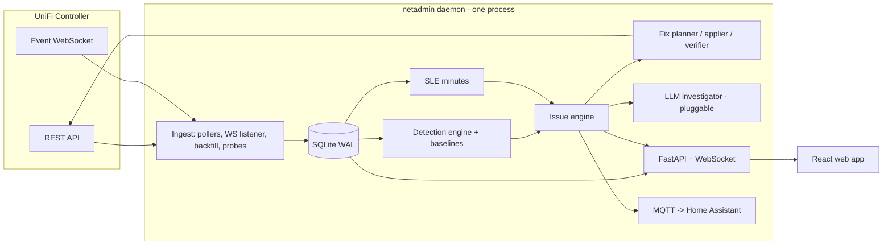

# UnifiOptimizer Rebuild — Architecture

**Status:** approved plan, branch `rebuild/core`
**Date:** 2026-07-21
**Role split:** Fable architects and reviews; Opus workers (effort high/xhigh) implement via Workflow phases.

## 1. What this is

A ground-up rebuild of UnifiOptimizer's core around one idea: the tool behaves like a network admin, not a report generator. A network admin remembers. They notice a port started throwing errors on Tuesday, watch it for a day, conclude the cable is bad, tell you, and check their fix actually held. The current codebase cannot do any of that because every run is a stateless snapshot. This rebuild adds the missing spine: a local time-series store, a continuous collector, detectors with confounder checks, and an issue-lifecycle engine that tracks every finding from first sighting to verified fix.

Product decisions already made (see `memory/product-vision-and-decisions.md`):

1. Two runtime modes, one engine: an always-on daemon, plus the existing on-demand "tech visit" mode.
2. Deterministic detectors, with a pluggable LLM investigator on top (manual markdown exchange, GitHub Copilot CLI, or Anthropic API; no key required for v1).
3. Greenfield core in a new `netadmin/` package; proven detector math salvaged from old code; old CLI untouched until cutover.
4. One controller, one site for v1. `site_id` is in every table anyway.
5. Home Assistant integration for alerting via MQTT discovery.
6. Runs on both arm64 and amd64 (Mac mini/Pi class and x86 NAS/server class). Consequences: dependencies must ship wheels for both architectures (no source-only native deps), Docker images are multi-arch via buildx, and nothing may shell out to arch-specific binaries.

## 2. Design verdicts

Each of these came out of the July 2026 research pass (three cited research reports; sources in the reports).

| Question | Verdict | Why |
|---|---|---|
| Metrics store | SQLite, one file, WAL | NetAlertX proves this exact scale (500 devices, 5-min scans, ~10-50 MB). No second process to babysit. |
| Rollups | Written at ingest, same transaction | Netdata's approach. No rollup job that can fall behind or double-count. |
| Retention | raw 30 d, hourly 18 mo, daily forever | Zabbix/Netdata converged pattern; year-over-year comparisons stay possible. |
| Issue identity | Fingerprint hash + upsert | Alertmanager/PagerDuty `dedup_key` semantics. "Still broken, day 5" = `now - first_seen`. |
| Issue states | pending → active → resolving → resolved | Prometheus `for:` semantics plus clear-streak hysteresis and a 24 h reopen window. |
| Detection math | Static thresholds + rolling quantile bands; CUSUM later | Mist's classifiers are 2σ-from-baseline rules, not ML. Explainable, runs anywhere. |
| Health score | Mist-style SLE user-minutes with exclusive classifier attribution | The score and its explanation are the same data structure. The anti-UniFi-"Experience" choice. |
| Scheduler | APScheduler AsyncIO in FastAPI lifespan, one process, one uvicorn worker | Multi-worker schedulers double-fire. One process sidesteps the whole class of bugs. |
| Real-time events | Controller WebSocket `/proxy/network/wss/s/{site}/events` | Same stream Home Assistant uses. Poll `stat/event` only as catch-up. |
| Controller auth | X-API-KEY preferred, cookie+CSRF fallback | API key is stateless, revocable, and community-verified to work on classic endpoints on UniFi OS. Legacy self-hosted controllers still need cookie login. |
| Why the daemon is mandatory | Controller keeps 5-minute stats ~1 day | Anything not collected daily is gone. Backfill on startup covers gaps up to controller retention. |

## 3. System overview



One Python process runs everything. The poller, detectors, issue engine, and API server share the event loop; heavy analysis runs in a thread executor. A second process is a scaling option we deliberately do not need yet.

### Two modes, one engine

The daemon and the "tech visit" mode share every layer. On-demand mode is: create a working DB (temp file or the real one), run `backfill` against everything the controller still retains (5-min/hourly/daily reports, events, per-client sessions), run all detectors over that window, print/serve the results. It is literally the daemon's startup path without the scheduler. This is why backfill is a first-class module and not a recovery hack.

## 4. Data layer (`netadmin/store/`)

SQLite, one file (`data/netadmin.db`). Non-negotiable pragmas: `journal_mode=WAL`, `synchronous=NORMAL`, `busy_timeout=5000`, `foreign_keys=ON`. Every writing transaction opens with `BEGIN IMMEDIATE` (a read-then-upgrade transaction fails instantly regardless of busy_timeout; this is the known trap). One poll cycle = one transaction. Migrations are numbered SQL files applied by a tiny runner; schema version lives in `PRAGMA user_version`.

```sql
-- Inventory. entity_type: ap | switch | gateway | client | port | radio | wlan
CREATE TABLE entities (
  entity_id   INTEGER PRIMARY KEY,
  site_id     TEXT NOT NULL DEFAULT 'default',
  entity_type TEXT NOT NULL,
  native_id   TEXT NOT NULL,          -- MAC for devices/clients, "<sw_mac>:<port_idx>" for ports, "<ap_mac>:<radio>" for radios
  parent_id   INTEGER REFERENCES entities(entity_id),   -- port -> switch, radio -> ap, client -> current ap/switch
  name        TEXT, model TEXT,
  first_seen_ts INTEGER NOT NULL, last_seen_ts INTEGER NOT NULL,
  meta        TEXT NOT NULL DEFAULT '{}',               -- JSON: oui, fingerprint, capabilities, is_wired...
  UNIQUE (site_id, entity_type, native_id)
);

-- Discrete state history: firmware version, link speed, up/down, channel, ip, uplink type...
CREATE TABLE state_changes (
  id INTEGER PRIMARY KEY, entity_id INTEGER NOT NULL REFERENCES entities(entity_id),
  attr TEXT NOT NULL, old_value TEXT, new_value TEXT, ts INTEGER NOT NULL
);
CREATE INDEX idx_state_entity_ts ON state_changes(entity_id, ts);

-- Interned series dimension: one row per (entity, metric)
CREATE TABLE series (
  series_id INTEGER PRIMARY KEY,
  entity_id INTEGER NOT NULL REFERENCES entities(entity_id),
  metric TEXT NOT NULL, unit TEXT,
  UNIQUE (entity_id, metric)
);

-- Raw samples. Counters stored as computed deltas (rate), not cumulative values.
CREATE TABLE samples (
  series_id INTEGER NOT NULL, ts INTEGER NOT NULL, value REAL NOT NULL,
  PRIMARY KEY (series_id, ts)
) WITHOUT ROWID;

CREATE TABLE samples_hourly (
  series_id INTEGER NOT NULL, bucket_ts INTEGER NOT NULL,
  n INTEGER NOT NULL, min REAL, max REAL, avg REAL, sum REAL, last REAL,
  PRIMARY KEY (series_id, bucket_ts)
) WITHOUT ROWID;
-- samples_daily: identical shape, bucket = UTC day

-- Normalized event log (WS + stat/event catch-up, deduped by controller event _id when present)
CREATE TABLE events (
  id INTEGER PRIMARY KEY, ts INTEGER NOT NULL,
  key TEXT NOT NULL,                   -- EVT_WU_Roam, EVT_SW_PoeOverload, ...
  entity_id INTEGER REFERENCES entities(entity_id),
  related_entity_id INTEGER REFERENCES entities(entity_id),   -- roam: from-AP; port event: client...
  native_id TEXT, msg TEXT, data TEXT NOT NULL DEFAULT '{}'
);
CREATE INDEX idx_events_ts ON events(ts);
CREATE INDEX idx_events_entity_ts ON events(entity_id, ts);

-- Collector accounting: gaps must be queryable, never inferred
CREATE TABLE poll_runs (
  ts INTEGER NOT NULL, job TEXT NOT NULL, ok INTEGER NOT NULL,
  duration_ms INTEGER, error TEXT, source TEXT NOT NULL DEFAULT 'live'  -- live | backfill
);

-- Issue lifecycle (see section 7)
CREATE TABLE issues (
  id INTEGER PRIMARY KEY,
  fingerprint TEXT NOT NULL,           -- sha1(detector_key + entity native_id + salient dims)
  detector_key TEXT NOT NULL, entity_id INTEGER REFERENCES entities(entity_id),
  severity TEXT NOT NULL,              -- p1 | p2 | p3
  state TEXT NOT NULL,                 -- pending | active | resolving | resolved
  first_seen_ts INTEGER NOT NULL, last_seen_ts INTEGER NOT NULL, resolved_ts INTEGER,
  clear_streak INTEGER NOT NULL DEFAULT 0, occurrences INTEGER NOT NULL DEFAULT 1,
  ack_ts INTEGER, snooze_until_ts INTEGER,
  title TEXT NOT NULL, evidence TEXT NOT NULL DEFAULT '{}',   -- JSON: latest supporting metrics
  fix_state TEXT,                      -- proposed | applied | verified | failed
  reopened_from INTEGER REFERENCES issues(id)
);
CREATE UNIQUE INDEX idx_issues_open_fp ON issues(fingerprint) WHERE state != 'resolved';

CREATE TABLE issue_events (
  id INTEGER PRIMARY KEY, issue_id INTEGER NOT NULL REFERENCES issues(id),
  ts INTEGER NOT NULL, kind TEXT NOT NULL,   -- detected | escalated | acked | snoozed | fix_proposed | fix_applied | fix_verified | fix_failed | resolved | reopened | investigated
  detail TEXT NOT NULL DEFAULT '{}'
);

-- SLE accounting (see section 8)
CREATE TABLE sle_minutes (
  bucket_ts INTEGER NOT NULL,          -- 5-minute bucket
  sle TEXT NOT NULL,                   -- coverage | roaming | capacity | connect | wan | infra
  classifier TEXT NOT NULL,            -- 'ok' or the failure classifier
  entity_id INTEGER NOT NULL,          -- the client (or device for infra)
  attributed_entity_id INTEGER,        -- the AP/port/cable the failure is pinned on
  minutes REAL NOT NULL,
  PRIMARY KEY (bucket_ts, sle, classifier, entity_id)
) WITHOUT ROWID;

-- Applied config changes (replaces data/change_history.json; keeps revert)
CREATE TABLE changes (
  id INTEGER PRIMARY KEY, ts INTEGER NOT NULL, issue_id INTEGER REFERENCES issues(id),
  entity_id INTEGER, action TEXT NOT NULL,
  before_json TEXT NOT NULL, after_json TEXT NOT NULL,
  status TEXT NOT NULL,                -- applied | reverted | failed
  reverted_ts INTEGER
);

-- EWMA / rolling-quantile state per series (and per hour-bucket where seasonal)
CREATE TABLE baselines (
  series_id INTEGER NOT NULL, bucket TEXT NOT NULL,   -- 'all' or 'h00'..'h23' (+ 'we'/'wd' suffix if needed)
  stat TEXT NOT NULL,                  -- ewma_mean | ewma_var | p05 | p50 | p95
  value REAL NOT NULL, updated_ts INTEGER NOT NULL,
  PRIMARY KEY (series_id, bucket, stat)
) WITHOUT ROWID;

-- LLM investigations (section 10)
CREATE TABLE investigations (
  id INTEGER PRIMARY KEY, issue_id INTEGER NOT NULL REFERENCES issues(id),
  ts INTEGER NOT NULL, provider TEXT NOT NULL,        -- manual | copilot | anthropic
  dossier_md TEXT NOT NULL, response_md TEXT, status TEXT NOT NULL  -- pending | answered
);
```

Rules that keep this honest:

- Counters (`rx_errors`, `tx_bytes`, ...) are cumulative on the controller. The repository stores per-interval deltas, handling counter resets (reboot: delta < 0 → treat as `new_value`).
- A gap is the absence of rows plus a `poll_runs` failure record. Never write zeros for "unreachable." Detectors evaluating a window with under 50% expected samples return UNKNOWN, not OK.
- Retention is a nightly `DELETE` per tier. Backfilled rows are marked by `poll_runs.source` and are coarser than live rows; detectors treat backfilled intervals as partial evidence.
- Repository is the only module that touches SQL. Everything else calls `Repository` methods. This is the seam where VictoriaMetrics could slot in later; nothing else would change.

## 5. Ingest layer (`netadmin/ingest/`)

### 5.1 UniFi client (`netadmin/ingest/unifi/`)

Async, httpx-based. Three auth modes behind one interface, auto-detected in order:

1. `X-API-KEY` against `/proxy/network/api/...` (UniFi OS consoles, Network 9.x). Preferred: stateless, revocable, no CSRF dance.
2. Cookie + CSRF against `/proxy/network/api/...` (UniFi OS, password login). Salvage the 499/2FA and CSRF-echo handling from `api/cloudkey_gen2_client.py`.
3. Cookie against `:8443/api/...` (legacy self-hosted controller).

Typed wrappers only for endpoints we use. Read set:

| Endpoint | Cadence | Feeds |
|---|---|---|
| `stat/device` | 60 s | port_table (errors, speed, duplex, autoneg, PoE, full SFP DOM block, satisfaction), radio_table_stats (cu_total, cu_self_rx/tx, tx_retries, satisfaction), uplink (latency, drops, speed), system stats, chassis thermals, firmware |
| `stat/sta` | 60 s | per-client rssi, noise, satisfaction, tx_retries, wifi_tx_attempts, rates, roam_count, anomalies, powersave, wired path (sw_mac/sw_port) |
| `stat/health` | 60 s | WAN/www latency, drops, xput, uptime; subsystem status |
| WebSocket `wss/s/{site}/events` | live | all EVT_* keys in real time |
| `stat/event` | 5 min | catch-up dedupe for anything the socket missed (3000/page cap, page with `_start`) |
| `stat/report/5minutes.{ap,user,gw,site}` | 6 h + startup backfill | fine-grained history the controller only keeps ~1 day |
| `stat/report/hourly.*`, `daily.*` | daily + backfill | long-window trends |
| `stat/session` (per problem client) | on demand from detectors | roam/session forensics |
| `stat/rogueap` (`within=24`) | daily | neighbor/rogue BSS inventory for CCI and coverage context; the poll keeps a per-BSS sighting log and distinct-channel log in `meta` |
| `rest/wlanconf` | daily (GET) | our own configured SSIDs, as `wlan` entities. A read: it is what lets `wifi.rogue_ap` tell one of our SSIDs from a neighbour's. Absent route degrades to the client-reported ESSID fallback |
| `list/alarm`, `stat/anomalies` | 15 min | controller-side anomaly signals |
| `stat/sitedpi` (if enabled) | daily | traffic context, optional |

Write set (Phase 4, all gated): `rest/device/{id}` (radio_table overrides: channel, ht, tx_power_mode/tx_power, min_rssi), `port_overrides` in the same PUT, `cmd/devmgr` (`power-cycle` port, `restart`, `speedtest`), `rest/wlanconf`, `cmd/stamgr` (`kick-sta` only; never block without explicit user action).

Unofficial v2 endpoints (`ports/port-anomalies`, `wan-slas`, `topology`) are wrapped behind feature probes that tolerate 404: use when present, never depend on them.

#### Optical and thermal fields (what `stat/device` actually exposes)

Verified against recorded payloads and a read-only `stat/device` on a live CloudKey. This is the whole of it; nothing else is inferred.

| Field | Where | Notes |
|---|---|---|
| `sfp_rxpower`, `sfp_txpower`, `sfp_temperature`, `sfp_voltage`, `sfp_current`, `sfp_rxfault`, `sfp_txfault`, vendor/part/serial | per `port_table` row | The full DOM block, present only when an optic is seated. An empty cage reports `sfp_found: false` and no readings at all, so ingest emits nothing for it rather than a zero. The controller exposes no DOM **alarm thresholds**, so bias current is judged against the module's own baseline, never an invented absolute limit. |
| `general_temperature`, `has_temperature`, `overheating`, `has_fan`, `fan_level` | device **top level** | Not inside `system-stats`, which is the mistake the first cut of the mapper made. One chassis sensor per device on hardware that has one; `has_temperature` / `has_fan` are recorded into entity `meta` as capability flags so a detector skips sensor-less hardware instead of reading its silence as "cool". |
| `uptime` | device top level | Recorded as a gauge (it resets on reboot) so the thermal detector can rule out a post-boot transient. |

Not available, so nothing is designed against it:

- **Per-sensor CPU / PHY / local temperatures** (`temperatures[]`): UniFi gateways only (UDM / UXG). A gateway-less site has none, so there is no CPU-temperature detector.
- **AP thermals**: every AP reports `has_temperature: false` and its `system-stats` carries only cpu / mem / uptime.
- **ONT / fiber optical levels**: no gateway and no ONT in `stat/device`. Out of scope entirely.

### 5.2 Collector jobs (`netadmin/ingest/collector.py`)

APScheduler AsyncIOScheduler, started in FastAPI lifespan. Every job: `max_instances=1`, `coalesce=True`, fixed start offsets so cadences do not align. Every cycle wrapped in an exception firewall that records `poll_runs` and increments a consecutive-failure counter surfaced at `/api/health`. A supervisor task restarts a dead WS listener with backoff.

Controller-unreachable is itself a detector input (and inhibits everything else; section 7).

### 5.3 Backfill (`netadmin/ingest/backfill.py`)

On startup (and on demand in tech-visit mode): read max stored `ts` per job; if the gap exceeds one interval, pull `stat/report` for the gap window, insert with original timestamps, `source='backfill'`. Cap at controller retention (5-min ≈ 1 day, hourly ≈ 7 days, daily ≈ 31+ days; verify per install at runtime, the "auto" retention defaults on Network 9.x are unpublished).

### 5.4 Active probes (`netadmin/ingest/probes.py`)

The controller reports no DNS or DHCP timing at all, so a small prober runs alongside the pollers: DNS resolution timing against the gateway resolver and one public anchor every 60 s (warn > 150 ms, critical > 1 s sustained), and ICMP RTT to the gateway. This unlocks the DNS-slowness, upstream-resolver, and strengthens bufferbloat detection (latency-under-load = WAN throughput near plan rate while probe RTT triples). Plan rate is a config input, refined by speedtest history p95.

## 6. Detection layer (`netadmin/detect/`)

A detector is a small class registered in a catalog:

```python
class Detector(Protocol):
    key: str                    # "wired.bad_cable"
    scope: EntityType           # what it iterates over
    cadence: Cadence            # FAST (each poll), WINDOW (15 min), DAILY (config audits)
    def evaluate(self, ctx: DetectorContext) -> list[Finding]: ...

@dataclass
class Finding:
    detector_key: str
    entity: Entity
    severity: Severity          # P1 | P2 | P3
    dims: dict[str, str]        # extra fingerprint dimensions (e.g. band, peer AP)
    title: str
    evidence: dict              # numbers that justify it, verbatim
    confounders_checked: list[str]   # audit trail: which false-positive traps were tested
    proposed_fix: Fix | None
```

`DetectorContext` exposes the repository (windowed series queries, baselines, events, inventory, rogue-AP table) and helpers (`baseline_band(series, hours)`, `expected_coverage(window)`). Detectors never touch SQL and never construct issues; they emit findings, the issue engine owns lifecycle.

Confounder checks are structural: a detector lists the traps it tested in `confounders_checked`, and the investigator dossier (section 10) prints them. This is what separates an admin from alarm spam.

**Evidence is stored, and the API returns it, in the detector's own insertion order** — narrative order (the headline measurement first, then its comparison, then supporting facts), never alphabetised. `Repository.insert_issue`/`update_issue`/`record_issue_event` deliberately do not pass `sort_keys=True` to `json.dumps` for `evidence`/`issue_events.detail`, so a detector author's field order survives to the issue detail page unchanged.

Each `Playbook` (the field-guide entries in `catalog.py`, keyed by `detector_key`) can additionally carry `evidence_fields: tuple[EvidenceField, ...]` — a proper label/unit/order override for the evidence keys worth calling out by name — and `confounder_notes: Mapping[str, ConfounderNote]`, one narrated sentence per confounder key computed from the issue's own evidence at request time (e.g. `"PoE draw checked: it dropped to 0 W between flaps (up to 8.5 W) — a powered-device reboot loop, not a bad link."`). `GET /api/issues/{id}` resolves both against the issue's live evidence and returns them as `evidence_layout` / `confounder_notes`; a detector without either still renders fine — the issue detail page falls back to a generically humanized key with a conservative unit inferred from its suffix (`_ms`, `_dbm`, `_fraction`, `_s` → compact duration).

### Detector catalog v1 (from the July 2026 playbook research; thresholds cited there)

| Key | Signature (compressed) | Sev |
|---|---|---|
| `wired.bad_cable` | rx_errors delta rate > 10/min sustained or > 0.001% of packets; OR gigabit-capable peer negotiated at 10/100 (broken-pair downshift). Confounders: known-100Mbps device classes, counter age, unmanaged-switch hop | P2, P1 on uplink |
| `wired.duplex_mismatch` | `full_duplex=false` on modern link | P2 |
| `wired.port_flapping` | ≥5 link transitions/10 min or ≥10/h from events; weight infra ports higher; correlate PoE draw 0 between flaps (reboot loop) | P2, P1 for AP/uplink |
| `wired.uplink_saturation` | uplink bps > 80%/95% negotiated speed 5 min+ with rising tx_dropped; hour-of-day baseline first | P2 |
| `wired.poe_budget` | Σ poe_power > 80%/90% budget; `EVT_SW_PoeOverload` | P2/P1 |
| `wired.stp_loop` | `EVT_SW_StpPortBlocking`, stp_state churn | P1 active |
| `wired.broadcast_storm` | broadcast/multicast pps > 10× 24 h baseline on multiple ports at once | P1 |
| `wired.sfp_degraded` | SFP DOM out of band on any arm: rx power at/below the sensitivity floor or drifting down from baseline, tx power below its floor, module temperature over its limit, bias current risen ≥25% above its own baseline (aging laser), sfp_rxfault/txfault. Confounder: a hot host chassis explains a warm module, so module temperature is never a standalone trigger | P2, P3 drift-only |
| `wifi.sticky_client` | RSSI < −75 sustained ≥ 10 min while a historically-better AP exists for this client; corroborate low rates + high retries. Confounder: no better AP = coverage hole, different issue | P3, P2 if clustered on one AP |
| `wifi.pingpong_roamer` | Meraki definition verbatim: 2 APs, ≥4 roams, ≤10 s apart; plus stationary-device rate tiers (>4-6/h suspicious, >10-15/h definite) | P3/P2 |
| `wifi.roam_quality` | roam events where post-roam RSSI > 10 dB worse, or roam latency tiers when measurable | P3 |
| `wifi.min_rssi_misconfig` | min-RSSI enabled on mesh-uplink AP (latent outage), single-AP site, or stricter than −70 | P2/P3 |
| `wifi.channel_plan` | Two scopes. **Per radio**: 2.4 GHz off 1/6/11 (`channel_off_grid`), 40 MHz on 2.4 (`wide_channel_24ghz`). **Per band, one site-scoped issue** on the `rf_env` pseudo-entity: `co_channel_reuse` when the reuse is *avoidable* (the busiest candidate channel carries ≥ 2 more of our radios than the quietest; a balanced maximal spread is optimal and never fires), and `wide_channel_dense_5ghz` for 80 MHz width with 4+ APs. The 2.4 GHz band fix is planned jointly, one step per radio moved | P3, P2 only when a named radio is materially congested |
| `wifi.dfs_recurring` | `EVT_AP_RadarDetected` ≥ 1/day or same-hour pattern → recommend non-DFS for that AP | P3/P2 |
| `wifi.airtime_saturation` | cu_total > 50% sustained (degraded) / > 80% (critical); split self vs non-self for the fix path | P2/P1 |
| `wifi.tx_power_loud` | multi-AP site at High/auto-max power; corroborate sticky-client concentration; 2.4 not ~6 dB below 5 GHz | P3→P2 |
| `wifi.legacy_rates` | 802.11b clients present or min rate at 1 Mbps | P3 |
| `wifi.band_steering` | dual-band client parked on 2.4 at strong RSSI with idle 5 GHz on same AP; inverse: held on 5 GHz ≤ −80 | P3 |
| `wifi.mesh_uplink` | wireless uplink RSSI worse than −65/−70, hops ≥ 3, reconnect cycles; also wired AP with meshing enabled | P2 |
| `wifi.neighbor_density` | ≥ 3 strong (> −75 dBm), persistent-across-scans neighbour BSSes overlapping our channels on a band. **One site-scoped issue per band**, keyed on an `rf_env` pseudo-entity (`rf:2.4`/`rf:5`/`rf:6`), never one per BSSID. Per-AP, per-channel and top-offender detail is evidence | P3, P2 only when an overlapped radio is materially congested |
| `wifi.rogue_ap` | Security only, per BSSID, fingerprinted on subtype (channel is deliberately out of the fingerprint). `ssid_spoof`: a foreign BSS broadcasting one of our own SSIDs (from `rest/wlanconf`, else our clients' ESSIDs), M=1 so it is reported the day it appears. `controller_flagged`: the controller's own `is_rogue` attestation, lifted when the BSSID's vendor+device MAC prefix matches a wired client. Cannot see an on-wire rogue the controller does not flag whose wired MAC is unrelated to its BSSID | P1 spoof; P2 controller-flagged, P1 corroborated |
| `client.flaky` | reason-code-weighted disconnects (codes 1/2/3/7/15 pathological, 8 benign) above tiers, then the attribution matrix: one client+one AP = device-or-deadspot; one client+many APs = device; many clients+one AP = AP fault; many clients bad RSSI one AP = coverage hole | P3, P2 by attribution |
| `client.dhcp` | 169.254.x self-assigned addresses, association-without-IP > 30 s, pool > 85% if UniFi gateway | P1 network-wide, P3 single |
| `client.known_pathology` | device-class KB (ESP32 vs PMF/11r, iOS −70 roam scan, Sonos vs IGMPv3) matched against symptoms and WLAN config | P3 |
| `wan.isp_degraded` | health latency > 2× 7-day rolling median 15 min+, loss > 1%; trend beats absolute | P2, P1 > 5% loss |
| `wan.bufferbloat` | probe RTT loaded-minus-idle > 200 ms while WAN near plan rate | P2 |
| `wan.flapping` | `EVT_GW_WANTransition` ≥ 3/24 h | P1 repeating |
| `wan.dns_slow` | probe: gateway resolver > 150 ms / > 1 s sustained; compare vs public anchor to separate local from upstream | P2 |
| `net.coverage_hole` | Cisco CHD adapted: per-AP client-RSSI histogram; p25 < −75 or > 20% client-hours < −80, and no better AP in those clients' history | P2 |
| `net.firmware_regression` | change-point on upgrade events: 7 d pre/post per device on disconnects/client-hour, port errors, radio resets; escalate when same model+version degrades fleet-wide; exclude first 2 h post-upgrade | P2/P1 |
| `infra.device_down` / `infra.controller_down` | lost-contact events + poll failures; controller_down inhibits everything | P1 |
| `infra.device_overheating` | controller `overheating` flag (P1); chassis temperature held ≥ `crit_c` for the whole window (P2); sustained rise ≥ `drift_c` above the device's own temperature baseline (P3, dust/failing-fan creep). Skips hardware reporting `has_temperature: false`. Confounders: warm ambient (two or more sensors hot at once suppresses the drift arm), post-reboot transient, fan state as evidence | P1 / P2 / P3 |

Thresholds for the two thermal/optical detectors, like every other detector's, live in `settings.thresholds[detector_key][name]` with the detector's own inline defaults: `infra.device_overheating` uses `warn_c` 80, `crit_c` 90, `drift_c` 8, `min_uptime_s` 600; `wired.sfp_degraded` adds `tx_power_floor_dbm` −8, `module_temp_max_c` 70, `bias_drift_pct` 25, `chassis_hot_c` 60 to its existing `rx_power_floor_dbm` / `drift_db`. No new config block, no schema change: the new series are gauges and the existing retention tiers and series interning absorb them.

Out of scope, stated honestly in docs: late collisions (no counter exposed), ARP conflicts (no visibility), non-WiFi interferer identification (no spectrum classification; "unexplained utilization" inference only), confident hidden-node detection, client-side downlink RSSI, per-sensor CPU/PHY temperature (gateway-only hardware this site does not have), AP chassis thermals (no sensor exists), ONT/fiber optical levels (not in `stat/device`).

### Baselines (`netadmin/detect/baseline.py`)

EWMA mean+variance and rolling P05/P50/P95 per series, updated at ingest, persisted in `baselines`. Hour-of-day buckets only for diurnal metrics (client counts, airtime, WAN throughput). RSSI gets no seasonal baseline; 3 am RSSI should equal 3 pm RSSI. Detectors require 2-3 consecutive out-of-band cycles before emitting (Prometheus `for:` semantics live in the issue engine, but detectors also debounce at the sample level). CUSUM change-point detection on hourly rollups ships in a later phase as the "regression since <date>" detector.

## 7. Issue engine (`netadmin/issues/`)

Pure logic, no I/O beyond the repository. The heart of "relentless."

- **Fingerprint**: `sha1(detector_key | site_id | entity native_id | sorted(dims))`. One open issue per fingerprint (partial unique index enforces it).
- **Upsert**: finding arrives → open issue with that fingerprint exists? bump `last_seen_ts`, `occurrences`, refresh evidence, reset `clear_streak`. Else create in `pending`.
- **pending → active**: condition holds M consecutive evaluations (per-detector M, default 3).
- **active → resolving → resolved**: detector's clear condition (absence of the finding, or explicit clear signal) increments `clear_streak`; resolved at K clean evaluations (default 6). A fire during `resolving` snaps back to `active`. The *first* clean check writes a `resolving` `issue_events` row (`{clear_streak, k}`) — every later clean check while still resolving advances `clear_streak` on the issue row with no new event, so the issue detail's lifecycle trail pairs this one event with the issue's live `clear_streak` to show "N of K" clearing progress without a row per tick (Gitea #26).
- **Reopen window**: same fingerprint fires within 24-48 h of `resolved` → reopen the old row (`reopened_from` links), not a fresh issue. Flap damping at the issue level.
- **Inhibition**: `infra.controller_down` suppresses all issue creation and all clear-streak advancement (absence of evidence is not evidence of absence). `infra.device_down` for a switch suppresses that switch's port issues. Rules are data, not code: `(cause_key, suppressed_scope)` pairs.
- **Snooze/ack** mute notifications, never evaluation.
- **Fix verification**: when a fix is applied through the fix engine, `fix_state='applied'` arms a verification window (default 48 h). Issue resolves inside it → `fix_verified`. Refires → `fix_failed`, and the issue's next investigation dossier says so. This closes the propose → apply → verify loop.
- Every transition writes `issue_events`. The issue detail page renders that trail; nothing is untraceable.
- **Transition stream**: `add_callback` / `remove_callback` publish every transition to the daemon's subscribers (the WebSocket broadcaster, the HA bridge, the alert dispatcher, the auto-investigator). Delivery is fire-and-forget: a raising callback is logged and swallowed, and callbacks are fired from a snapshot so one that unregisters itself cannot disturb the delivery in flight.
- **Subscription contract**: `add_callback` appends unconditionally, so every subscriber unregisters in its own `stop()`. Left attached, a stop/start cycle inside one process registers a second copy and delivers every notification twice. `remove_callback` is idempotent (safe before a start and safe twice) and drops every equal registration, and each subscriber registers remove-then-add, so `start()` is safe to call twice.

## 8. SLE health model (`netadmin/sle/`)

Adapted from Juniper Mist. Each 5-minute bucket, each active client contributes minutes judged pass/fail per SLE; every failed minute is attributed to exactly one classifier and, where possible, one infrastructure entity:

| SLE | Fail when | Classifiers |
|---|---|---|
| coverage | active minute at RSSI below threshold | weak_signal, asymmetry_suspected |
| roaming | roam events in bucket were bad | pingpong, sticky, slow_roam |
| capacity | radio cu_total > threshold during activity | wifi_interference, non_wifi_util, client_load |
| connect | association/auth/DHCP failures observed | assoc, auth, dhcp, dns |
| wan | WAN latency/loss out of band | isp_latency, isp_loss, bufferbloat, wan_down |
| infra | device unreachable/restarting | ap_down, sw_down, gw_down, restart_loop |

"Idle client with bad RSSI = 0 failed minutes" is the property that makes the score honest: impact-weighted by construction. Headline health = weighted blend of SLE scores, always one click from its classifier breakdown; the score and the explanation are the same `sle_minutes` GROUP BY. Classifier bad-minute rates are themselves detector inputs (a classifier crossing its band opens an issue).

### Two-tier activity gate

`SleMinutesJob._is_active` decides "active" from `SleConfig.activity_metrics` (default `rx_bytes`/`tx_bytes`) reaching `activity_bytes_per_min` for the bucket. On controllers where the live poller carries no byte counters at all (`stat/sta` maps rssi/satisfaction/tx_retries/wifi_tx_attempts/tx_rate/rx_rate/roam_count, no bytes — see `netadmin/ingest/mapping.py`), those counters land only via the periodic `report.5minutes.user` backfill, hours after the bucket closed and long after the per-tick `sle_minutes` job already evaluated it. A bucket with no byte samples at all is not assumed idle: the gate falls back to a live per-interval counter (`activity_fallback_metrics`, default `wifi_tx_attempts`) against its own `activity_packets_per_min` floor. Tier 1 wins whenever it has any sample this bucket; tier 2 only fires when tier 1 has none. A client with no samples on either tier stays idle — the honest-zero property holds regardless of which tier decided it.

Because the live job only ever computes a bucket once (the last complete bucket, per tick), the tier-2 answer is what most buckets get at evaluation time. Once the backfill sweep lands real bytes for those buckets, `netadmin/ingest/factory.py`'s `_recompute_sle_after_backfill` re-runs `SleMinutesJob.run_range` over exactly the buckets the `user`-scope report just touched (`ScopeResult.min_ts`/`max_ts`), never past the bucket still filling. The recompute is delete-then-rewrite (`run_bucket`/`run_range(..., clear_existing=True)` → `Repository.delete_sle_minutes`): a plain upsert only touches the cells the new pass produces, so a cell an earlier pass wrote that the byte-accurate pass no longer produces (a classifier that no longer applies, or a client the byte-accurate gate now excludes) would otherwise strand. Both the recurring `reports_5min` collector job and the one-shot startup backfill trigger this recompute.

### Exposure and the confidence floor (`/api/sle`)

`sle_scores` (`netadmin/sle/scores.py`) reports, per SLE, `evaluated_buckets` (distinct 5-minute buckets that produced any judgment) against `window_buckets` (the window's total). An SLE with a real score computed from too little of that — under `MIN_EXPOSURE_FRACTION` (20%) of the window's buckets, or under `MIN_EXPOSURE_MINUTES` (30) judged minutes — is `below_floor`: a real number, never hidden, but excluded from the headline blend (`ScoreReport.excluded_below_floor`) and never painted with a confident Good/Fair/Poor band in the UI.

A `score is None` SLE is ambiguous for the per-occurrence SLEs (roaming, connect: both only ever write a row when something happens, never a per-bucket "ok, nothing occurred" row). The `/api/sle` router resolves that ambiguity two ways it cannot from `sle_minutes` alone:

- **quiet pass** — roaming or connect has no data, but `coverage` (written for every active wireless client whenever RSSI is present, riding the same activity gate) cleared the exposure-fraction floor this window, so the absence reads as a confirmed "nothing happened," not a gap (`SleEntryRow.quiet_pass`).
- **not measurable** — `connect` specifically has no data and no event of any kind has landed recently (`Repository.max_event_ts`), the signal that the WS listener (the only lifecycle-event source on UniFi OS 9.x) has stopped delivering. Reported as `measurable: false` with an explicit `unmeasurable_reason`, never silently folded into "no exposed minutes." Never overrides an SLE that DID score something (e.g. a link-local-IP DHCP failure needs no event).

`web/src/pages/dashboard/SleHealthBlock.tsx` renders exactly these states: a confident score only when `measurable && !below_floor && score != null`; a neutral "Insufficient data — measured X of Y intervals" otherwise; a distinct reassuring quiet-pass line; and the explicit unmeasurable reason. The sparkline keeps its dots-with-gaps rendering but captions the chart with the same exposure count so gaps read as sampling holes, not network chaos.

The WS listener itself dying after start and never restarting (`netadmin/ingest/events.py`'s `WsSupervisor`) is a separate, open issue — the exposure/measurability work above represents it honestly but does not fix it.

## 9. Fix engine (`netadmin/fixes/`)

Salvages `core/change_applier.py`'s before/after snapshot discipline, now recorded in the `changes` table and linked to issues.

- **Planner**: maps detector/classifier → remediation template with parameters filled from evidence (channel plan proposal, tx_power step-down, min-RSSI removal on mesh AP, PoE port cycle, port disable/enable, WLAN setting change). A plan is a *list* of steps: a site-scoped issue whose subject is a band, not a device, renders one step per device it moves and the steps are ordered deterministically so the confirm token is reproducible (see the channel-plan split in §17).
- **Safety rails**: never touch mesh-uplink APs' min-RSSI except to remove it; never change more than N devices per apply, and a template that could exceed the guard caps itself rather than render a plan the applier would refuse; every apply captures the full before-state for revert, per step, so each change reverts independently; a step that fails stops the plan with the prior steps' `change_ids` recorded; dry-run renders the exact API payloads; applying requires explicit user action in UI/CLI (the daemon never self-applies in v1).
- **Verifier**: section 7's fix-verification arm. Revert is one click and re-uses the stored before-state.
- **History vs. plan, as two separate reads** (Gitea #26): `GET .../fix-history` returns the ledger (`changes`) and `verification` for an issue straight from the store — no device reader is built, so it never reaches the controller and is safe to fetch unconditionally on every issue-detail load, resolved or not. `GET .../fix-plan` is the live, read-only dry-run for a *new* remediation and stays behind the operator's explicit "preview" click, since it is the one GET that actually talks to a device. The issue-detail UI uses history to show "what was applied, offer revert" immediately, and only shows the plan-preview flow while the issue is still open.

## 10. LLM investigator (`netadmin/llm/`)

Deterministic detectors find and track; the investigator explains and correlates. Pluggable provider behind one interface:

```python
class InvestigatorProvider(Protocol):
    name: str
    def investigate(self, dossier: str) -> str | None   # None = async/manual, answer comes later
```

- **Dossier builder** (provider-independent, the real value): for an issue, compile a single markdown document with the issue trail, evidence windows (rendered as compact tables), related issues on the same entity/segment, topology context, confounders already checked, and the relevant playbook entry. The dossier ends with structured questions (root cause? additional evidence to collect? recommended fix and risk?).
- **`manual`** (default, no key needed): writes the dossier to `investigations/issue-<id>.md`; you run it through any model you like; `netadmin investigate import <file>` (or paste in the UI) attaches the response to the issue.
- **`copilot`**: shells out to GitHub Copilot CLI non-interactively with the dossier, captures the response.
- **`anthropic`**: Claude API when a key exists. Model configurable.

Responses are stored in `investigations`, rendered on the issue page, and never auto-apply anything.

## 11. Home Assistant (`netadmin/integrations/home_assistant.py`)

MQTT discovery (the NetAlertX-style route, no custom HA component needed):

- `sensor.netadmin_health` (+ one sensor per SLE), `sensor.netadmin_issues_p1/p2/p3`.
- One `binary_sensor` per active P1/P2 issue via dynamic discovery, removed on resolve; attributes carry title, entity, duration, evidence summary.
- `netadmin/events` topic publishes issue transitions (created/escalated/resolved/fix_verified) for HA automations (notify phone on new P1, etc.).
- Config: broker host/port/credentials in `config.yaml`; feature off by default.
- `start` subscribes to the engine's transition stream and `stop` unsubscribes (section 7), so a restart inside one process publishes each transition once, not twice.

## 12. API and web app

### Backend (`netadmin/server/`)

FastAPI, mounted routers: `inventory`, `metrics` (windowed series for charts), `issues` (list/detail/ack/snooze/investigate), `sle`, `fixes` (history/propose/dry-run/apply/revert), `events`, `ondemand` (tech-visit runs), `system` (`/api/health`: last-poll age, WS state, DB size, consecutive failures). One real WebSocket (`/ws`) pushing issue transitions and poll heartbeats to the UI; the 2-second polling loop dies.

`inventory`'s device/client rollups (Gitea #23): an AP's `num_sta`/`satisfaction` are reported by the controller *both* per-radio (`radio_table_stats`) and at the device's own top level (`stat/device`) — confirmed against a real recorded payload, `tests/netadmin/unifi/fixtures/stat_device.json` — but `map_device` (`netadmin/ingest/mapping.py`) only ever emitted the per-radio series, so the devices list's "Load" summary and the AP detail's satisfaction/client-count charts always read empty, even though the same numbers already existed one level down. Both are now also emitted on the device entity. A client's "Roams" figure is a windowed count of that client's own `EVT_WU_Roam*` events (`Repository.event_counts_by_entity` / `event_count_for_entity`, last 24 h) — not the controller's `roam_count` metric, which `store/metrics.py` registers as a COUNTER (a per-poll delta, not a meaningful total) — so it always has a receipt in the client's own Journey/Timeline.

Web security fixes over the old server: JWT expiry 7 days (not 90), rate limiting on `/api/auth/*` (slowapi), CORS pinned to configured origins, controller credentials never stored in browser localStorage (JWT only, `SameSite` cookie preferred), API-key auth preferred over password so the daemon can hold a revocable key instead of an admin password. Secrets live in `data/secrets.env` chmod 600 (or macOS Keychain when available), never in git.

### Frontend (`web/`)

Keep React 19 + Vite + Tailwind + Zustand. Restructure around the issue-centric model:

| Route | Content |
|---|---|
| `/` dashboard | SLE health blocks with classifier breakdowns, active issues by severity, live event ticker |
| `/issues`, `/issues/:id` | The core surface. Detail = full lifecycle trail (each transition humanized to a sentence, e.g. "Escalated after 3 occurrences" / "Resolved after 6 clean checks", exact timestamp plus date once the entry isn't from today), evidence charts, confounders checked (narrated per-detector where the catalog supplies it, §6), investigation thread, fix propose/dry-run/apply/verify status. A `fix_applied`/`fix_proposed` change id links to `/changes?id=<id>`, which auto-expands and scrolls to that row |
| `/devices`, `/devices/:id` | Per-device page at last: state history, port/radio metrics charts, issues past and present, config |
| `/clients/:id` | Journey timeline, RSSI/roam history, SLE minutes, issues |
| `/timeline` | Network-wide event density (salvage the existing visualization) |
| `/changes` | Change ledger with revert |
| `/visit` | Tech-visit mode: run, watch progress (real WS), browse the resulting report |
| `/settings` | Controller/auth, thresholds, HA, LLM provider |

Design work goes through the `refined-designer` subagent per global instructions (both themes, content-first), grounded in the researched design contract at `docs/DESIGN_FOUNDATION.md` (Apple HIG patterns, AA-verified tokens, chart rules, the 10 never-do rules); readability outranks density everywhere. Every UI change must pass an adversarial front-end UX review agent (layout, readability, accessibility, dark-mode parity, edge cases: long names, empty states, hundreds of issues) before it lands. Salvageable components: topology DAG, event-density chart, journey expander internals, health ring.

## 13. Salvage map

| Old | Fate |
|---|---|
| `core/client_health.py` scoring curves | Port math into SLE classifiers + `client.flaky` detector |
| `core/network_analyzer.py` journey classification | Port into roaming detectors (thresholds updated to Meraki definitions) |
| `core/switch_analyzer.py` | Port checks into `wired.*` detectors; add SFP/flap/autoneg from new API fields |
| `core/advanced_analyzer.py` airtime/DFS/min-RSSI/band-steering | Split into `wifi.*` detectors |
| `api/cloudkey_gen2_client.py` auth quirks | Salvage into new async client (CSRF echo, 2FA 499, UniFi OS path detection) |
| `core/change_applier.py` + change tracker | Fix engine applier + `changes` table |
| `server/services/discovery.py` | Keep nearly as-is |
| Web components (DAG, timeline, journeys) | Reuse in restructured UI |
| `core/html_report_generator.py` (5,331 lines, dead) | Delete at cutover |
| `core/html_report_generator_share.py`, root test scripts, analysis_cache pattern | Delete at cutover |
| `core/report_v2.py` | Keep for CLI tech-visit report until `/visit` replaces it, then delete |
| `client_rssi_tracker.py` | Superseded (its attrs bug made it return empty anyway); roam forensics move to `stat/session` + local history |

## 14. Repo layout (target)

```
netadmin/
├── __init__.py  config.py  logging.py  cli.py
├── ingest/    unifi/ (client.py auth.py endpoints.py models.py ws.py)  collector.py  backfill.py  probes.py
├── store/     db.py  repository.py  migrations/ (0001_init.sql ...)
├── domain/    entities.py  types.py
├── detect/    engine.py  baseline.py  context.py  catalog.py  detectors/ (wired.py wifi.py client.py wan.py net.py infra.py)
├── issues/    engine.py  models.py  inhibition.py
├── sle/       minutes.py  classifiers.py
├── fixes/     planner.py  applier.py  verifier.py
├── llm/       provider.py  dossier.py  manual.py  copilot.py  anthropic.py
├── integrations/ home_assistant.py
└── server/    main.py  ws.py  routers/ (issues.py inventory.py metrics.py sle.py fixes.py ondemand.py system.py auth.py)
tests/netadmin/   (mirrors the package; fixtures from recorded controller payloads)
```

Old `core/`, `api/`, `server/` stay untouched and working until Phase 5 cutover.

## 15. Implementation plan (Workflow phases, Opus workers)

Fable writes contracts and reviews between phases; Opus agents (effort `high`, `xhigh` for the starred stages) implement inside each Workflow. Every phase ends with: tests green, `./check_code.sh` clean for new code, a review fan-out with adversarial verification, and a Fable review gate before the next phase starts.

| Phase | Contents | Notes |
|---|---|---|
| **0 Foundation** | Package scaffold, pyproject `[project]`, config (pydantic-settings + YAML), logging (rotating file + rich console), store layer complete with migrations and rollups-at-ingest, UniFi client with all three auth modes and typed read wrappers, issue engine* complete | Storage, client, and issue engine build in parallel against this doc; integration agent wires and greens the suite |
| **1 Ingest** | Collector jobs, WS listener + supervisor, backfill, probes, inventory sync + state_changes, poll_runs, `/api/health` | Needs a live-controller smoke test script with recorded-fixture fallback |
| **2 Detection** | Baseline engine, detector framework, all catalog-v1 detectors*, SLE minutes*, issue engine wired end-to-end | Detector unit tests use synthetic series fixtures per playbook signatures, including confounder cases |
| **3 Surface** | FastAPI routers, real WebSocket, React restructure (issue pages, device/client pages, SLE dashboard) | UI via refined-designer; Apple HIG patterns; both themes; adversarial UX review gate on every change |
| **4 Act** | Fix planner/applier/verifier, HA MQTT, LLM investigator (dossier + manual + copilot) | Applies gated behind explicit user action |
| **5 Ship** | Tech-visit mode (`/visit` + CLI), multi-arch Docker (linux/arm64 + linux/amd64 via buildx), systemd/launchd units, install.sh update, README rewrite, delete dead code, cutover | Old CLI removed only here; arm64+amd64 verified before cutover |

Testing strategy: recorded controller payloads as fixtures (sanitized MACs); pure-logic layers (issue engine, baselines, SLE, detectors) get exhaustive unit tests; one end-to-end test drives a synthetic "bad week" (cable degrades, client flaps, firmware regresses) through ingest → detect → issues and asserts lifecycle transitions.

## 16. Risks and open items

- **Undocumented API drift**: `stat/report` attrs, WS event schema, and v2 endpoints are version-dependent. Mitigation: feature probes at startup, recorded fixtures per controller version, UNKNOWN over guess.
- **Event/alarm retention is unpublished**; the WS listener plus 5-min catch-up makes local capture the source of truth quickly.
- **Satisfaction formula is proprietary**; we use it as a signal, never as ground truth (our SLE model replaces it).
- **Copilot CLI interface stability** for the investigator provider; the manual provider is the guaranteed path.
- **Controller hardware**: heavy `stat/report` queries are Mongo aggregations on the CloudKey; keep windows narrow, backfill in chunks.
- Open item: where the daemon runs long-term (Mac mini? Docker on NAS?). Affects packaging priorities in Phase 5 only; either way both arm64 and amd64 are supported targets (decision 6), so the choice narrows nothing.

## 17. Correlation & incidents (the "seasoned expert" layer)

Detectors and the issue engine make netadmin a relentless watchdog: every real
problem gets found, tracked, and confirmed. What a seasoned network admin does on
top of that is **connect the dots** — "your weak Back Porch mesh backhaul is *the*
problem; the coverage hole in that cell and the three clients dropping there are
its symptoms; fix the backhaul and the rest clears." Without this, a spread-out
fault reads as a scatter of separate issues and the operator has to do the
synthesis. This section adds that synthesis, deterministically.

### Concept

An **incident** is a set of open issues that share one root cause. One issue in
the set is the **root** (the thing to fix); the rest are **symptoms** (they clear
when the root clears). Incidents are what the dashboard leads with — "3 things
need attention" instead of "11 scattered issues" — while the underlying issues
keep their own independent lifecycles untouched.

Correlation is complementary to inhibition (§7), not a replacement. Inhibition is
the *hard* suppression case (a downed switch means we do not even open its ports'
issues — absence of evidence). Correlation is the *soft* explanation case: the
symptom issues are genuinely observed and independently tracked, but grouped under
a root so the operator sees one story. Inhibition prevents noise; correlation
explains the noise that remains.

**Conservatism is the design constraint.** A wrong grouping — attributing a
symptom to the wrong root, or fusing two unrelated problems — is more misleading
than no grouping at all, exactly like a lying chart. The engine therefore only
links issues with a concrete topological or causal-rule basis, records the
rationale for every link, and leaves anything it cannot confidently attribute as a
standalone single-issue "incident of one." No statistical guessing; rules only.

### Data model (`netadmin/store/`, new migration)

```sql
CREATE TABLE incidents (
  id INTEGER PRIMARY KEY,
  fingerprint TEXT NOT NULL,            -- sha1(root issue fingerprint) — stable identity across passes
  root_issue_id INTEGER NOT NULL REFERENCES issues(id),
  severity TEXT NOT NULL,               -- max severity across members
  state TEXT NOT NULL,                  -- open | resolved (resolved when all members resolved)
  first_seen_ts INTEGER NOT NULL, last_seen_ts INTEGER NOT NULL, resolved_ts INTEGER,
  title TEXT NOT NULL,                  -- plain-language root-cause line
  summary TEXT NOT NULL DEFAULT ''      -- "Weak backhaul on Back Porch Mesh is causing 1 coverage hole + 3 client dropouts in that cell"
);
CREATE UNIQUE INDEX idx_incidents_open_fp ON incidents(fingerprint) WHERE state != 'resolved';

CREATE TABLE incident_members (
  incident_id INTEGER NOT NULL REFERENCES incidents(id),
  issue_id INTEGER NOT NULL REFERENCES issues(id),
  role TEXT NOT NULL,                   -- root | symptom
  rule TEXT NOT NULL,                   -- the correlation rule that linked it (e.g. "mesh_uplink->coverage_hole:same_ap")
  rationale TEXT NOT NULL,              -- one human line: why this symptom is attributed to this root
  PRIMARY KEY (incident_id, issue_id)
);
```

An `incident_id` is exposed on the issue read model (a join, not a stored column
on `issues`, so issue lifecycle logic stays untouched).

### Correlation engine (`netadmin/correlate/`)

Runs as a scheduler job after each `detect_fast`/`detect_window` pass (and after
`detect_daily`). Pure logic over the current open-issue set + inventory topology;
the only I/O is the repository. Idempotent: recompute groupings from open issues
each pass, preserving incident identity by root fingerprint.

Algorithm:
1. Load all open issues (pending excluded — unconfirmed) + the entity topology
   (parent/child: switch→ports, AP→radios, AP↔associated-clients, gateway→site).
2. Apply **causal rule templates** (the encoded expert knowledge — a data table of
   `(root_detector, symptom_detector, topological_relation, direction)` with a
   rationale template). Seed set:
   - `wifi.mesh_uplink` → `net.coverage_hole` (same AP), `client.flaky` (clients on that AP), `wifi.airtime_saturation` (that AP's radio).
   - `wired.port_flapping` / `wired.bad_cable` on the port feeding an AP/switch → that downstream device's issues.
   - `wan.isp_degraded` → `wan.dns_slow`, `wan.bufferbloat`, and network-wide client latency symptoms.
   - `wired.stp_loop` / `wired.broadcast_storm` → widespread AP/client issues on the affected L2 segment.
   - `net.firmware_regression` on a device → that device's post-upgrade degradations.
   - `infra.device_down` → any surviving issues on that device / its children (usually already inhibited; incident makes it the explicit root when not).
   - `wifi.tx_power_loud` on an AP → `wifi.sticky_client` concentrated on that AP.
3. Apply a **temporal guard**: a symptom only attaches to a root if the symptom's
   `first_seen` is not materially *before* the root's (a symptom cannot predate its
   cause by more than a slack window). This kills spurious links.
4. **Root selection** when multiple candidate roots exist for a symptom: prefer the
   more upstream/infrastructural cause (wired-feeding-AP beats the AP's own wifi
   issue; WAN beats per-client; a firmware regression beats the symptom it caused).
   A fixed rule priority, documented, so it is reproducible.
5. Emit incidents: each with its root, members + per-member rule/rationale, a
   generated plain-language `title`/`summary`, severity = max member severity.
   Every issue not attributed to any root becomes a standalone incident-of-one —
   engine bookkeeping, load-bearing for idempotency (identity = `sha1(root
   fingerprint)`, and the retained-incident path below depends on the row
   already existing if a solo issue later gains a symptom). This is uniform at
   the engine/store layer; the presentation layer reserves the word "incident"
   for a genuine 2+ member group (see Surface, Gitea #21).
6. Incident lifecycle: an incident resolves when all its members resolve; the LLM
   investigator (§10) can be pointed at an incident (not just an issue) to narrate
   the whole story on demand — but the clustering itself is never LLM-driven.

### Two smaller additions shipped alongside

- **The neighbour-scan pair** (`netadmin/detect/detectors/wifi.py`). The
  `stat/rogueap` table is read every day; one detector per question, because the
  two questions it answers have different answers, audiences and lifecycles.
  - `wifi.neighbor_density` answers "is this band crowded". A neighbour BSS
    qualifies when it is recent, persistent across distinct recent scans, above
    the RSSI floor, and overlapping one of our channels (co-channel on any band,
    adjacent within 4 channels on 2.4 GHz); own hardware is excluded by the
    known-BSSID allowlist and the own-Ubiquiti-prefix cross-reference. At
    `density_min_count` (default 3) qualifying neighbours the band fires **one
    site-scoped issue**, on an `rf_env` pseudo-entity (`native_id` = `rf:<band>`,
    outside `EntityType`, so the issue carries a NULL `entity_id`). Fingerprint
    `sha1(key|site|rf:<band>|band=<band>)` is stable forever: density changes
    update evidence, they never churn rows. P3 as context; P2 only when an
    overlapped radio is materially congested, which is the hook into
    `wifi.airtime_saturation` through correlation.
  - `wifi.rogue_ap` answers "is one of these a security problem", per BSSID, with
    the subtype in the fingerprint and the channel out of it, so a channel-hopping
    twin stays one issue and its observed channels ride along as evidence. It runs
    at M=1 (`FIRST_FIRE_CONFIRM_M`): on a daily cadence, M=3 would mean three days
    between spotting a foreign AP on our SSID and saying so. With no resolvable
    SSID set the spoof subtype is UNKNOWN, never guessed, and the examined BSSIDs
    are returned as per-entity UNKNOWNs so an open spoof issue freezes rather than
    falsely resolving.
  - The report treats them accordingly: `wifi.neighbor_density` joins
    `wifi.channel_plan` in the collapsed environmental finding; `wifi.rogue_ap`
    surfaces as its own ranked finding.
  - Migration `0005_retire_legacy_rogue_ap.sql` retires every pre-split
    `wifi.rogue_ap` issue at startup, in one silent step, writing an
    `issue_events` row per retired issue with the honest reason (superseded by the
    new taxonomy) and closing any incident rooted on one. Ageing them out instead
    would have cost six more days of flood, fired one resolve transition per row
    into alerts, the LLM auto-investigator and Home Assistant, and recorded a
    falsehood: the problem did not go away, the taxonomy changed. Legacy
    fingerprints can never be produced again, so the 24 h reopen window cannot
    resurrect a retired row.
- **The channel-plan split** (`netadmin/detect/detectors/wifi.py`,
  `netadmin/fixes/planner.py`). `wifi.channel_plan` carried two different kinds of
  problem at one scope, and the per-radio scope was wrong for one of them. A
  six-radio site held eighteen open rows for about three decisions: co-channel
  reuse fired from *every* end of a conflict, the 80 MHz width policy repeated
  once per wide radio, and, because a band with more radios than non-overlapping
  channels must reuse some of them, assignments that were already optimal were
  reported as permanent, unfixable defects.
  - **Per-radio defects stay per radio**: `channel_off_grid` and
    `wide_channel_24ghz`. One radio, one wrong setting, one single-step fix;
    fingerprints unchanged.
  - **Plan-level defects become one site-scoped issue per band**, on the same
    `rf_env` pseudo-entity (`rf:2.4`/`rf:5`) `wifi.neighbor_density` uses, with
    fingerprint `sha1(key|site|rf:<band>|band,subtype)`. `co_channel_reuse` fires
    only when the reuse is **avoidable**: with our radios counted per candidate
    channel (`candidate_channels_24` = 1/6/11, `candidate_channels_5` = the
    non-DFS 36/44/149/157, both site-tunable), the busiest candidate must carry at
    least two more radios than the quietest. That is exactly when moving one radio
    strictly improves the spread, so a balanced maximal spread stays silent
    instead of sitting open forever. `wide_channel_dense_5ghz` is one issue for
    the band with its radios as evidence. P3 as a config audit; P2 only when one
    of the named radios is materially congested, the same escalation and
    thresholds the density detector uses.
  - **The fix is joint.** A band-scoped 2.4 GHz conflict plans one ordinary
    `CHANNEL_CHANGE` step per radio moved, with the channels assigned *together*
    from the evidence's per-channel load vector. Planning each radio on its own is
    what used to rotate both ends of a pair onto the same new channel; a joint
    greedy assignment (busiest channel drained onto the quietest, ties on the
    lower channel number) cannot. Nothing about the gates changes: one approval
    covers the plan, the confirm token is recomputed from the rebuilt plan so any
    device drift refuses the apply, steps run in order and stop at the first
    failure with the prior steps' `change_ids` recorded, and each change reverts
    on its own. The plan is capped at `MAX_JOINT_CHANNEL_MOVES` (3, at or under
    the applier's max-devices guard) so a rendered plan can always actually apply;
    the rest of the band is re-planned on the next pass. 5 GHz channel choice and
    both width sub-cases stay advisory, for the same DFS/RF-planning reason every
    other 5 GHz channel move is refused.
  - Migration `0006_retire_plan_level_channel_plan.sql` retires every open
    `wifi.channel_plan` row whose evidence subtype is `co_channel_reuse` or
    `wide_channel_dense_5ghz`, on the 0005 pattern: an `issue_events` row per
    retired issue with the honest reason, then the resolve, then any incident
    rooted on one. `channel_off_grid` and `wide_channel_24ghz` rows are untouched:
    their fingerprints are still produced, so their lifecycle continues.
- **Problem-device ranking** (`GET /api/devices/offenders`, `/clients/offenders`
  + a UI view): rank entities by a composite problem burden — failed SLE
  client-minutes attributed to them, open-issue count weighted by severity, and
  disconnect/roam event volume over the window. This is the "who causes most of my
  grief" leaderboard, computed as GROUP BYs over `sle_minutes`, `issues`, and
  `events`; no new storage. Surfaced on the dashboard ("Top offenders") and as a
  sortable page.

### Surface

- API: `GET /api/incidents` returns **genuine incidents only** by default —
  `member_count >= 2`, via the one repository-level predicate
  `Repository.is_genuine_incident` (also used by `incident_brief_for_issues` and
  MCP, so "genuine" cannot drift between surfaces). `include_singletons=true`
  restores the engine's uniform one-row-per-root projection, for the dashboard's
  "Needs attention" card. `GET /api/incidents/{id}` (root, members with
  role/rationale, the root's proposed fix, investigation hook) is unchanged and
  serves both genuine incidents and singletons by id. The issue read model's
  `GET /api/issues` gains `incident_id` + `incident_role` (unconditional, as
  before) and `incident_brief` (`{id, title, summary, severity, symptom_count}`,
  present only when the incident is genuine) so the Issues list can group root +
  symptoms into one row with no second fetch. `GET /api/issues/{id}`'s
  `incident` ref gains `symptom_count`.
- UI (Gitea #21): no standalone "Incidents" nav entry or list page — on a real
  capture that list has one row while ten other open issues sit elsewhere, which
  is the "11 vs 14" confusion this closes. Issues (`/issues`) is the one place
  every open issue lives: a genuine incident renders as one group row (the
  engine's title, its correlation summary as a second line, severity = the
  incident's, a "N issues" expander revealing the root — labeled — and its
  indented symptoms inline); a standalone issue renders exactly as before. The
  page header carries the reconciliation in prose ("14 open issues · 1 incident
  groups 4 of them") so the count is never ambiguous. Incident detail
  (`/incidents/:id`) still exists as the "whole story" page (root at top,
  symptoms grouped, the one recommended fix), reachable from a group row and
  from an issue's "Part of" line; a deep link that resolves to a singleton
  redirects to the issue instead of 404ing or showing a one-member "story". The
  issue detail "Part of" line renders only when `symptom_count > 0`, with
  role-specific copy ("Root cause of: … (N symptoms)" / "Symptom of: …") — a
  genuinely solo issue shows no line, so there is no self-link. The dashboard's
  "Needs attention" card (formerly "Active incidents") uses the uniform
  `include_singletons=true` projection for honest all-open-work triage, with an
  "All issues" link to `/issues`. MCP's `netadmin_incidents` and
  `netadmin_overview` narrate the same genuine/standalone split instead of
  counting every incident-of-one as an "incident". No migration: this is a
  read-time filter over unchanged engine/store rows. Both themes; the
  adversarial UX review gate applies. The "Top offenders" panel lands on the
  dashboard and a dedicated page.

## 18. First-run web onboarding & controller connect (§12 addendum)

The daemon must be usable by someone who has never edited `secrets.env`. On a
fresh install the web app runs a setup flow that connects the controller and
hands back an access token, so the only prerequisite is "the daemon is running."

### The two credentials, and why setup exists

- **UniFi API key** (or username/password): what the daemon uses to read the
  controller. Created on the user's console. This is the "connect my network" step.
- **Web-UI access token** (`NETADMIN_API_TOKEN`): gate-keeps the dashboard/API on
  the LAN. Arbitrary; the daemon can generate it.

The old setup screen asked for the *second* and described it as a file path —
backwards from the user's mental model. The new flow is about the *first*, and the
token becomes something the daemon mints and shows once.

### Setup state machine

`GET /api/setup/status` → `{configured: bool, controller_connected: bool}`.
`configured` is false when no controller credential and no UI token exist. The web
app branches on this: **unconfigured → the SetupFlow; configured → the token gate.**

### Endpoints (`netadmin/server/routers/setup.py`)

All three are reachable **only while `configured` is false** (the first-run
window). Once configured they return 409 and require the normal bearer auth. This
is the standard self-hosted first-run pattern (a fresh Home Assistant / router):
the chicken-and-egg of first-run has no prior credential, so the mitigation is
that setup *locks itself the moment it succeeds*.

- `POST /api/setup/detect {host}` → runs `detect_console(host)` (read-only,
  §5.1/CONTROLLER_SETUP), returns the `ConsoleInfo` + the per-console API-key
  playbook + the console URL to "open my controller". Optionally a discovery scan
  assists filling `host`.
- `POST /api/setup/connect {host, api_key}` (or `{host, username, password}`) →
  1. Validate the credential against the controller with a **read-only** probe;
     reject cleanly on auth/reachability failure (never a raw error).
  2. Write `UNIFI_HOST` + `UNIFI_API_KEY` (or user/pass) to `data/secrets.env`
     (create if absent, chmod 600, never logged).
  3. If no `NETADMIN_API_TOKEN` exists, generate one (CSPRNG) and write it too.
  4. Hot-start ingest: build the collector/WS/probes/backfill from the new
     settings and start them in the running process (no restart). The lifespan's
     ingest bring-up is refactored into a `connect(settings)` the endpoint reuses.
  5. Return `{ok: true, ui_token}` — the token, **once**, so the UI can show it.
     The UniFi key is never returned.
- `POST /api/setup/skip-demo` (optional): when a demo build is served, jump
  straight into the demo DB without a controller.

### Frontend (`web/src/pages/onboarding/SetupFlow.tsx`, replaces the bare gate)

Multi-step, DESIGN_FOUNDATION-compliant, both themes:
1. **Connect** — a host field (auto-discovery assist), then on detect: "Found:
   CloudKey Gen2 Plus at <host>", the device-specific API-key steps, an **Open my
   controller ↗** link (new tab to the console), a paste-key field, **Connect**.
   Honest inline errors (wrong key, unreachable) — never a raw 401/500.
2. **Save your token** — on success, show the generated access token once with a
   Copy button and "save this to get back in", then **Enter dashboard**. The token
   is persisted in `localStorage` for this browser as today.
3. Returning users (configured) never see this — they get the token gate, whose
   copy is fixed to "Paste your access token" (not "from data/secrets.env").

### Security requirements (hard, reviewed)

- Setup endpoints work **only** while unconfigured; the connect handler
  re-checks state and 409s if a controller/token already exists (no reconfigure,
  no overwrite via setup — that path is CLI/secrets.env only).
- The UniFi key is written to the gitignored `secrets.env` (600) and **never**
  returned in any response or written to any log. The UI token is returned exactly
  once, by design.
- The connect validation probe is **read-only**; setup can never mutate the
  controller.
- Plaintext-over-LAN caveat (the daemon is HTTP on 8765) is documented, with the
  reverse-proxy-TLS recommendation for anyone exposing it beyond a trusted LAN.
- An existing deployment that already has `secrets.env` configured (e.g. the Mac
  mini) is `configured: true` from boot and shows the token gate, never the setup
  flow — so this changes nothing for already-running installs.

### 18.1 Auth model correction — "already set up = just works"

The original §12 gated every `/api/*` read behind the token, so a browser that
hadn't stored the token saw a gate even on a fully-configured install. That is
wrong for a self-hosted home tool: once it is set up, opening the dashboard should
just load. Revised model:

- **Reads are open on the LAN once configured.** Every GET (issues, sle,
  inventory, metrics, incidents, events, health, and the setup *status*) is served
  without a token. A configured daemon never shows a gate for viewing — the
  dashboard just works for any device on the network.
- **Mutations require the access token, prompted just-in-time.** Only the handful
  of endpoints that change something — `fix/apply`, `fix/revert`, `setup/connect`,
  `ack`/`snooze` — require the bearer token and fail closed without it. The UI
  keeps the token in `localStorage` and, if a mutating action is attempted without
  one, prompts for it once (the token shown at setup) and remembers it. So the
  first fix you apply asks once; nothing else ever gates you.
- The `/api/setup/*` first-run window is unchanged (unconfigured-only, locks on
  success). The "returning user token gate" from §18 is removed: configured →
  straight into the dashboard.
- **Tradeoff, stated:** anyone on the LAN can *view* the network data without a
  token (the dashboard is not a secret; the network-changing actions are what's
  protected). Anyone who wants viewing gated too runs it behind a reverse proxy or
  the loopback-only bind. This is the right default for a trusted home LAN.

### 18.2 Remote MCP token (`NETADMIN_MCP_TOKEN`) — settings only (Gitea #29)

Groundwork for the remote MCP mount described in `docs/MCP_SERVER.md`: a future
streamable-HTTP ASGI app at `/mcp`, serving the existing 11 read-only tools
(`netadmin/mcp/tools.py`) to a Claude client over the network instead of stdio.
This step adds only the credential surface, no route:

- `Settings.netadmin_mcp_token`, read from `NETADMIN_MCP_TOKEN` in
  `data/secrets.env` / the environment — **never** yaml, mirroring
  `netadmin_api_token`. Exposed through `Settings.mcp_token` (whitespace-only
  treated as unset).
- **Deliberately a separate credential from `NETADMIN_API_TOKEN`, with no
  fallback either direction.** The API token authorizes controller *mutations*;
  the MCP token is read-only by construction and independently rotatable. Since
  `GET /api/*` reads are open on a configured, LAN-published install (§18.1),
  reusing the API token for MCP would turn a config leaked from one laptop into
  network control, not just a privacy leak.
- `netadmin mcp-token` (CLI): prints the configured token, or errors to stderr
  (exit 1) when unset. `--regenerate` mints `token_urlsafe(32)` and persists it
  via `write_secrets` (atomic, chmod 600, every other key preserved) — the same
  pattern as `POST /api/system/token/regenerate`
  (`netadmin/server/routers/system.py`).
- A startup log line states whether remote MCP is configured
  (`NETADMIN_MCP_TOKEN` set) or disabled (unset).
- **No server behaviour changed in this step.** The route that consumes the token
  arrived in §18.3 below.

### 18.3 Remote MCP mount (`/mcp`): the gated route (Gitea #30)

`netadmin/server/mcp_mount.py` mounts the MCP SDK's streamable-HTTP ASGI app at
`/mcp` on the existing daemon, serving the same 11 read-only tools
(`netadmin/mcp/tools.py`, unchanged: it was written transport-agnostic for
exactly this). A Claude client on any machine on the LAN can now read the history
store without the package being installed there.

**Posture ladder, evaluated in this order.**

| State | Answer |
|---|---|
| No `NETADMIN_MCP_TOKEN` | `404` + `code: mcp_disabled`. The feature is absent, and a 401 would advertise a surface that serves nothing. |
| Wrong or missing bearer token | `401` + `WWW-Authenticate: Bearer`, constant-time compared via `auth.token_matches` |
| More than 10 *failed* attempts per client per 60 s | `429` + `Retry-After`, via `auth.FixedWindowRateLimiter` |
| Authenticated, SDK absent | `503` naming `pip install "unifioptimizer[mcp]"` |
| Authenticated, mount live | the MCP session |

Two ordering decisions matter. The token is checked **before anything reads the
request body**: nothing calls ASGI `receive` until the compare has passed, so an
unauthenticated caller cannot make the daemon buffer or parse a byte of JSON-RPC.
And the 503 is checked **after** the token, one step stricter than the sketch in
§18.2: it is deployment state, only the operator can act on it, and an
unauthenticated caller learns nothing about how the box is provisioned.

**Why the gate exists at all.** `GET /api/*` reads are open on the LAN once
configured (§18.1) and the mini is LAN-published, so an ungated mount would hand
any guest device the whole history store in one tool call. The credential is
`NETADMIN_MCP_TOKEN` and never `NETADMIN_API_TOKEN`, with no fallback either
direction: the API token authorizes controller mutations, so pasting it into a
Claude config on every laptop would turn one leaked file from a privacy problem
into network control.

**Read-only, three ways.** The mount opens its **own**
`Repository.open(..., read_only=True)` handle in the lifespan, never the daemon's
read-write one: SQLite `mode=ro` at the VFS layer, `PRAGMA query_only=ON` on the
connection, and a tool layer that imports nothing from `netadmin/fixes/` or
`netadmin/ingest/`. `tools.call_tool` carries the schema gate, so a store this
build does not understand answers with the same guidance sentence here as over
stdio.

**Transport.** Stateless, JSON-response streamable HTTP: a fresh transport per
request, no session table, no long-lived SSE stream beside the daemon's own
`/ws`. `serverInfo.version` is `netadmin.__version__`. The SDK's DNS-rebinding
protection is left off on purpose; a bearer token is the stronger guard and a
Host allow-list would break the LAN-by-IP access the feature exists for.

**What remote does not inherit.** The stdio server (`netadmin-mcp`) answers when
the daemon is down, because it opens the file itself. This one is part of the
daemon, so it answers only while the daemon runs. Both ship; they are not
interchangeable.

**Not in v1:** internet exposure, OAuth (static bearer only; a client that needs
OAuth uses the `mcp-remote` wrapper), TLS or mTLS (run a reverse proxy),
per-tool scopes, multi-user, phone or claude.ai connectors.
`NETADMIN_MCP_REDACT` still defaults to off and is still read per call, so it
governs this surface unchanged: going remote changes which machine the client
runs on, not what a model sees.

**Shared primitives.** `token_matches`, `extract_bearer`, `client_key`,
`scope_header` and `FixedWindowRateLimiter` are now public in
`netadmin/server/auth.py` and used by both gates, so the two cannot drift into
subtly different comparison or throttling rules. `ApiTokenAuthMiddleware` is
untouched: `/mcp` sits outside `/api`, so it never reaches that middleware's
rules, and nothing about the MCP token can authorize an `/api` request.

### 18.4 Remote MCP token reveal/regenerate in Settings (Gitea #34)

Managing `NETADMIN_MCP_TOKEN` was CLI-only (`netadmin mcp-token`) or a hand
edit of `secrets.env`. This adds a Settings surface beside the existing access
token section: `GET /api/system/mcp-token` (reveal) and `POST
/api/system/mcp-token/regenerate`, backing a `McpTokenSection` component next
to `AccessTokenSection`.

**Gating deliberately mirrors `/system/token` exactly, credential included.**
Reveal is open to a loopback peer or the *API* bearer token; regenerate is
gated + rate limited on that same API token, sharing the controller-writes
budget. The MCP token being managed is **never** the credential that unlocks
either route — a read-only, rotatable secret must not be able to authorize its
own rotation, the same reasoning that keeps it separate from the API token in
the first place (§18.2). `netadmin/server/auth.py` adds `SYSTEM_MCP_TOKEN_PATH`
/ `SYSTEM_MCP_TOKEN_REGENERATE_PATH` and `is_mcp_token_regenerate`, wired into
`ApiTokenAuthMiddleware` right beside their access-token equivalents, and an
unconfigured/open install (no API token at all) can still mint a *first* MCP
token through the same open-shortcut bootstrap the access-token regenerate
already gets.

**Rotation takes effect immediately, no restart — with one honest caveat.**
`regenerate_mcp_token` writes the new value to `secrets.env` (atomic, chmod
600, every other key preserved, same as the access-token path) and mutates the
live `Settings` object in place. `McpEndpoint.token` (the `/mcp` gate) reads
`settings.mcp_token` fresh on every request, so an **already-running** mount
refuses the old token and accepts the new one on its very next call, in the
same process, no restart. That immediacy is specific to *rotating* a mount
that is already up: `netadmin/server/mcp_mount.py`'s session manager is built
exactly once, in the daemon lifespan, and only when `settings.mcp_token` was
already set at boot. So minting the **first** token for a daemon that started
with none configured still leaves `/mcp` answering 503 (`mcp_unavailable`)
until the daemon restarts and `start_mcp` runs again — this step does not
change that; the UI copy says so rather than promising something the mount
does not yet do.

**The Claude Code snippet is copy-paste, never a placeholder.** The Settings
card renders `claude mcp add --transport http unifioptimizer <origin>/mcp
--header "Authorization: Bearer <token>"` only once the real token is on
screen (after Reveal or Regenerate), with its own copy button — there is
nothing here to paste and have silently fail against a token that was never
actually issued.

**Not changed:** `netadmin mcp-token` (CLI), the `/mcp` mount itself, or
`NETADMIN_MCP_REDACT`. This step is the Settings-side counterpart to the CLI
path added in §18.2, nothing more.

## 19. Report export (feature)

An in-app **Export report** action produces a professional network assessment
report (the structure, findings template, chart set, severity colours, honesty
conventions, and anti-slop rules are the binding spec in `docs/REPORT_SPEC.md`,
merged from WLAN-survey / OWASP-PTES / Mist-Meraki conventions).

- **Backend** (`netadmin/report/`): a report assembler that returns the full
  report model from real repository queries only — scorecard, per-section data,
  findings in the fixed template shape (observation/impact/root-cause/
  recommendation, correlated issues grouped as one finding via the incident
  engine), chart data series, and topology. `GET /api/report` (open read, §18.1).
  No number is computed in the UI; the UI renders what the assembler returns.
- **Frontend**: a print-optimised `/report` route rendering the model with the
  existing hand-rolled SVG chart primitives (no chart library, no matplotlib in
  the runtime). An **Export report** button (dashboard + sidebar) opens it and
  triggers the browser's Save-as-PDF — no server-side PDF engine, keeping the
  daemon dependency-light per the "pip install and run" value.
- **No false data / no slop** are hard gates, reviewed adversarially: every value
  traces to a query; neighbour-AP noise is aggregated context not per-BSSID
  alarms; prose passes the refined-prose firewall; charts pass the dataviz rules.

## 20. Outbound alert channels (`netadmin/integrations/alerts/`)

Push notifications for the three lifecycle moments worth waking someone for, over
plain HTTP. Same posture as §11: off by default, credentials only in
`data/secrets.env`, and a failure here can never reach the daemon.

- **Providers**: `discord`, `slack`, `ntfy`, and `webhook` (raw JSON in the §11
  events-topic shape plus `event` / `source` / `site_id`). Payload builders are pure
  functions in `formats.py`, one pair per provider (single event + digest), each
  truncated to that provider's documented caps.
- **Transport**: one `AlertTransport` Protocol over `httpx`, which is already a core
  dependency, so this adds **zero new runtime dependencies**. Tests inject a fake and
  no test opens a socket.
- **Config**: `alerts.enabled` plus a list of channels in `config.yaml` (`name`,
  `type`, `min_severity`, `events`, `timeout_s`, `rate_limit_per_min`). The delivery
  URL is a credential (a webhook URL is a bearer token wearing a URL costume) and is
  read only from `ALERT_URLS__<NAME>` in `data/secrets.env`; an optional
  `ALERT_TOKENS__<NAME>` becomes an `Authorization: Bearer` header. A channel with no
  URL is inert after exactly one startup warning.
- **What fires** (`policy.py`): `escalated` into ACTIVE with `reason == "m_reached"`
  is `opened`; `reopened` is `reopened`; `resolved` is `resolved`. Nothing else
  notifies. A `detected` issue is unconfirmed noise, and an `escalated` with
  `reason == "refire_during_resolving"` is a flap whose open was already announced.
  Per channel, a fingerprint is announced open at most once until it resolves, and a
  resolve is announced only where its open was.
- **Isolation**: one sync engine callback that only enqueues onto a bounded intake
  queue (512), a router task that runs policy once per transition, and a bounded
  per-channel queue (128) drained by its own worker. A hung webhook backs up only
  itself. Retries run in-line in the worker, so per-channel delivery stays FIFO and a
  resolve can never overtake the open it resolves.
- **Retry**: 2xx is delivered; 429 honours `Retry-After` capped at 300 s; 5xx,
  timeouts, and network faults back off from 2 s doubling to a 60 s cap over five
  attempts; any other 4xx is permanent, because a 401 or 404 means the URL is wrong.
  Five consecutive failures mark the channel `failing` and degrade `/api/health`. It
  keeps attempting future events; nothing self-disables.
- **Flood control**: a per-channel token bucket sized by `rate_limit_per_min`.
  Overflow coalesces into one digest message instead of being discarded, flushed when
  a token frees and force-flushed on shutdown. Queue overflow counts as `dropped`.
  Both counters reach the health block, so nothing is lost quietly.
- **Wiring**: built and started in the `server/main.py` lifespan beside the HA
  publisher, stopped first on shutdown with a 5 s drain. `stop` unsubscribes from
  the engine (section 7) and empties both queue layers, so a restart inside one
  process begins clean instead of on a leftover stop sentinel. `/api/health` gains an
  `alerts` block carrying per-channel `status`, `delivered`, `failed`, `dropped`,
  `digested`, `last_success_ts`, and `last_error`. No URL ever appears in health, in a
  log line, in `repr(Settings)`, or in an exception message.

## 21. Auto-investigation (`netadmin/llm/auto.py`)

A P1 that appears at 03:00 is worth a dossier at 03:01, not at 09:00 when someone
opens the tab. The `AutoInvestigator` subscribes to the issue engine's transition
stream and runs the same investigation the UI button runs, unattended.

Config block (`data/config.yaml`, `netadmin:`):

```yaml
investigate:
  auto:
    enabled: false            # master switch; default off
    provider: manual          # manual | copilot | anthropic
    severities: [p1]          # which severities trigger
    settle_s: 120             # wait after activation before compiling
    storm_threshold: 5        # more than N triggers inside storm_window_s = storm
    storm_window_s: 300
    max_per_hour: 4           # hard spend caps, counted per auto-run
    max_per_day: 12
    fallback_to_manual: true  # paid provider unavailable -> free manual dossier
```

- **Spend safety is structural.** `enabled` defaults false and `provider` defaults
  `manual`, so cost requires two separate edits. Flipping `enabled` alone buys a
  dossier file, never an API bill. Unknown provider or severity names are rejected
  when settings are constructed, not at the first P1. Credentials do not move:
  the anthropic provider still reads `ANTHROPIC_API_KEY` from `data/secrets.env`.
- **Triggers.** A transition qualifies when `to_state == ACTIVE` at a configured
  severity, which covers the M-cycle confirm, a refire out of `resolving`, and a
  reopen. `PENDING` never triggers, so the confirm is the first debounce.
  `settle_s` is the second: after dequeue the worker waits, then re-reads the
  issue and drops it silently unless it is still active at a configured severity.
  Flapping costs nothing.
- **Storm guard.** A rolling deque of trigger timestamps. Above `storm_threshold`
  inside `storm_window_s` the worker holds the queue until the rate falls, then
  drains, investigating only incident roots and uncorrelated issues; symptoms of a
  root are skipped with a logged reason. The storm is latched for the whole drain
  of the burst, because the first item sleeps out the storm window and its
  symptoms would otherwise look calm by the time they are dequeued. One dossier
  per storm, aimed at the cause.
- **Caps.** `max_per_hour` / `max_per_day` are rolling token buckets checked last.
  Exhaustion skips and counts; it never queues into the next window.
- **Isolation.** `on_transition` is sync and fire-and-forget: it filters cheaply
  and `put_nowait`s onto a bounded queue (256), dropping and warning when full. The
  engine, and so the detect jobs on the one scheduler, is never blocked and never
  sees an exception. One worker drains the queue on the loop thread, calls
  `start_investigation` there (SQLite is loop-bound, section 3), runs a blocking
  provider in `asyncio.to_thread`, and finishes with `complete_investigation` back
  on the loop. It reuses `llm/service.py`; there is no second orchestration path.
- **Idempotency.** At most one auto investigation per issue id, ever. Before
  starting, the worker checks `list_investigations(issue_id)`; any row, from any
  provider or status, means a human or a prior run already produced a dossier.
  This is durable across restarts because the `investigations` table is the source
  of truth, and a reopened issue keeps its id. The duplicate check and the row
  insert are adjacent with no `await` between them, which on a single-threaded
  loop makes them atomic against a manual click. The `investigated` event carries
  `detail["trigger"] = "auto"`, so the UI and HA can tell the two apart with no
  schema migration.
- **Failure handling.** `ProviderUnavailableError` falls back to the manual
  provider when `fallback_to_manual` is set: a real dossier is written, the row
  stays pending, and the UI says "awaiting import" honestly. Otherwise it skips
  with a warning. Never retried into spend. `ProviderRuntimeError` leaves the
  pending row and dossier intact, records a failed `investigated` event, and does
  not auto-retry; a human can re-run or import. Every queue item is firewalled, so
  one bad issue never kills the worker.
- **Wiring.** Built and started in the `server/main.py` lifespan beside the HA
  publisher and the alert dispatcher, stopped first on shutdown. `stop`
  unsubscribes from the engine (section 7) and drops the queued triggers with
  their bookkeeping, so a restart inside one process queues each activation once.
  `/api/health`
  gains an `auto_investigate` block with `enabled`, `running`, `provider`,
  `severities`, `queue_depth`, and per-reason counters (`queued`, `ran`,
  `skipped_duplicate`, `skipped_settled`, `skipped_storm`, `skipped_cap`,
  `dropped_full`, `failed`, `last_error`). No dossier text and no credentials
  appear in health.

## 22. Install surface (`pyproject.toml`, `Dockerfile.netadmin`, `docker-compose.yml`, `addon/`)

Three supported ways to install the same daemon. No second runtime, no forked
image: Compose and the Home Assistant add-on are packaging around the process
section 3 already describes. `pip install unifioptimizer` and the release
workflow are the reference path and stay untouched by the other two.

| Path | Artifact | Runs from | Data directory |
|---|---|---|---|
| pip | PyPI wheel (bundles `netadmin/_webui/`) | host Python 3.11+ | `NETADMIN_DATA_DIR`, else `./data` |
| Docker | `Dockerfile.netadmin`, built locally | `python:3.12-slim` | named volume at `/app/data` |
| HA add-on | `addon/`, installs the pinned PyPI wheel | HA Python base (Alpine) | Supervisor `/data` |

### Invariants every container path holds

These are not stylistic. Each one, dropped, is a user-visible failure, and
`tests/netadmin/test_container_packaging.py` asserts each against the shipped
files.

- **Loopback by default.** GET reads on the API are open by design once
  configured (section 18.1), so Compose publishes `127.0.0.1:8765:8765` and the
  add-on declares `8765/tcp: null`. Home Assistant publishes a mapped port on
  every interface with no loopback option, which is exactly why the add-on
  default is unmapped and opting in is the user's decision. State-changing
  routes already fail closed without `NETADMIN_API_TOKEN` / `api_token`, and
  `/mcp` (section 18.3) is separately gated by `NETADMIN_MCP_TOKEN` /
  `mcp_token`, but neither of those makes the read surface above safe to
  publish by default: see "MCP in the container paths" below.
- **Mutable state on a mount.** `secrets.env`, `config.yaml`, `netadmin.db`, and
  the logs live on the volume, so an image rebuild or an add-on update keeps the
  history the product exists to accumulate.
- **`NETADMIN_DATA_DIR` pinned, not inferred.** The cwd-relative default in
  `config.py` would land in the same place today; pinning it means a working
  directory change cannot silently relocate the database.
- **No secrets in tracked files.** Credentials reach the process through the
  volume's `secrets.env` (written by the first-run setup, section 18) or the
  environment. `.dockerignore` keeps them out of every image layer.

### Why the Docker path uses a named volume

The image runs as a non-root user (uid 501 by default). Docker seeds a fresh
named volume from the image with that ownership already correct on any host,
whereas a bind mount only works when the host directory happens to be writable
by that uid. The bind-mount variant is documented with `APP_UID`/`APP_GID` build
args for people who want the files on the host.

### Why the add-on has no ingress

Ingress is the better surface and does not work yet. Home Assistant serves an
add-on under `/api/hassio_ingress/<token>/` and strips that prefix before
proxying. The dashboard is a Vite SPA built with the default base of `/`, and its
API client requests absolute `/api/...` and `/ws` paths (`web/src/api/client.ts`,
`web/src/api/useWebSocket.ts`), which the browser resolves against the Home
Assistant root rather than the add-on. Enabling it today serves a blank page.

Turning it on is a frontend change: a runtime base path in the SPA, a matching
`base` in `vite.config.ts`, and that prefix applied in the API client and the
WebSocket URL builder. `ingress: false` is a recorded finding, not an untouched
default, and a test pins it so it cannot be flipped without the frontend work.

### MCP in the container paths (Gitea #32, #33)

Both `Dockerfile.netadmin` and `addon/Dockerfile` install the optional `mcp`
extra (`mcp>=1.2`, `pyproject.toml`'s `[project.optional-dependencies]`)
unconditionally, so the remote MCP mount at `/mcp` (section 18.3) works with no
rebuild the moment an operator sets a token; the daemon still answers 404
until then, since the route's presence depends on `NETADMIN_MCP_TOKEN` /
`mcp_token`, never on whether the package happens to be installed. It stays an
extra, not a twelfth core runtime dependency: the daemon itself never imports
it outside `netadmin/server/mcp_mount.py`, and the SDK is a pure-Python
(`py3-none-any`) wheel, so it does not weaken the add-on's
`--only-binary=:all:` musllinux guard.

- `docker-compose.yml` gets a commented `NETADMIN_MCP_TOKEN` passthrough
  beside the existing `NETADMIN_API_TOKEN` one: same opt-in shape, separate
  credential, no fallback either direction (section 18.2).
- `addon/config.yaml` adds `mcp_token` as a `password?` option next to
  `api_token`; `addon/run.sh` maps it to `NETADMIN_MCP_TOKEN` behind the same
  `bashio::config.has_value` guard every other option uses. The port itself
  stays unpublished by default in both paths; the MCP gate does not change
  that call, since `GET /api/*` is still the wider read surface being
  protected against.
- `deploy/update-macmini.sh`'s post-deploy probe now checks `/mcp` on every
  deploy: an unauthenticated request must answer `401` or `404` while
  `/api/health` stays `200`. Anything else, `200` above all, fails the
  deploy loudly with the same automatic rollback a failed health check gets,
  rather than silently shipping a generation whose MCP gate does not work.
  The script and `deploy/macmini.md` are gitignored local deploy docs, not
  tracked files, but their header comments were rewritten off the same stale
  "the API has NO authentication" framing this section corrects.

### Version coupling

The add-on installs one exact published wheel, so `pyproject.toml`
`[project].version`, `addon/config.yaml` `version`, and the
`ARG NETADMIN_VERSION` pin in `addon/Dockerfile` must agree. A test enforces it,
which makes a release a three-line bump rather than a debugging session.

Alpine bases mean every wheel must be musllinux. All eleven runtime dependencies
publish one for x86_64 and aarch64, including `pydantic-core`, `uvloop`,
`httptools`, and `watchfiles`, and `--only-binary=:all:` turns a future gap into
a loud build failure instead of a source compile in an image with no toolchain.

User-facing walkthrough: `docs/CONTAINER.md`.

## 23. Self-update (`netadmin/upgrade/`)

Four install methods (pip, Docker Compose, the Mac mini `container` deploy, the
Home Assistant add-on) each need a different true answer to "how do I update
this." Getting it wrong is worse than saying nothing: a pip self-upgrade button
inside a container upgrades nothing real, and a fake "click to update" anywhere
self-upgrade is not actually possible is exactly the kind of button this
project refuses to ship (`memory/ux-standards.md`).

**Status:** built end to end. Install-method detection, the PyPI version check
and its cache, the `app_meta` table, the startup schema gate, the
`GET`/`POST /api/system/update*` routes, the pip self-upgrade runner
(`netadmin upgrade run`), the Mac mini container deploy's own pre-upgrade
backup and automatic rollback (`deploy/update-macmini.sh`), and the web banner
(`web/src/layout/update/`) that drives these routes from the dashboard.

### Install-method detection (`netadmin/upgrade/detect.py`)

A first-hit-wins ladder, cheapest and most explicit signal first:

1. `NETADMIN_INSTALL_METHOD` env var, baked into `Dockerfile.netadmin`
   (`container`) and `addon/run.sh` (`addon`). `NETADMIN_UPDATE_VARIANT`
   (`compose` | `macmini`) rides along, set by `docker-compose.yml` and
   `deploy/update-macmini.sh` respectively, since both deploy paths build from
   the same Dockerfile and only differ in how the image is run.
2. Home Assistant add-on: `SUPERVISOR_TOKEN` is only set inside a
   Supervisor-managed container.
3. Any other container: `/.dockerenv` or `/proc/1/cgroup` naming docker,
   containerd, or podman.
4. Source checkout: the `unifioptimizer` distribution is not installed at all
   (a bare `PYTHONPATH` checkout), or its `direct_url.json` marks it editable
   (`pip install -e .`).
5. A pip virtualenv install: the distribution is installed, not editable, has
   no `direct_url.json` (an ordinary wheel from PyPI), and the interpreter is
   running inside a venv (`sys.prefix != sys.base_prefix`).

`self_upgrade_supported` is true only when detection actually resolved through
case 5 *and* that venv's `sys.prefix` is writable *and* the platform is POSIX.
An explicit env override, a system-wide (non-venv) pip install, and a
non-editable `direct_url.json` (a VCS/URL install) all report as `pip` for
display but never offer self-upgrade. Never a fake button.

### Version check (`netadmin/upgrade/checker.py`)

One background job, off only when configured off (`updates.check`, default
true). It sends one `GET https://pypi.org/pypi/unifioptimizer/json` with a
`User-Agent` naming this build's version, nothing in the body, no telemetry.
First check lands 60-300 s after the daemon is ready (jittered, so a fleet
restarting together does not all hit PyPI at once), then again every
`updates.interval_s` (default 86400 s / one day). A strict `X.Y.Z` tuple
compare decides `update_available`; anything looser (a pre-release, a stray
suffix) fails the parse and is treated as unknown rather than guessed at.

The result is cached in a new generic key/value table, `app_meta` (migration
0007: `key TEXT PRIMARY KEY, value TEXT NOT NULL`), read and written only
through `Repository.get_app_meta` / `set_app_meta` (section 4's "SQL stays in
the store module" rule holds here too). A 5 s request timeout and any failure
(network down, PyPI unreachable, a malformed response) log once, keep the last
cached answer, never raise, never touch `/api/health`'s `status`, and never
block startup: a version check is background information, not a dependency.

Config (`data/config.yaml`, `netadmin:`):

```yaml
updates:
  check: true       # default on; sends nothing but the GET above
  interval_s: 86400  # re-check cadence after the first
```

`UPDATES__CHECK=0` (or any nested-env override) works the same as every other
config block in this file.

### `__version__` (`netadmin/__init__.py`)

Derived from `importlib.metadata.version("unifioptimizer")`, never a literal.
This fixed a real bug: `__version__` was hardcoded at `"0.1.0"` while
`pyproject.toml` had moved on to `"0.3.0"`, so the MCP server, the FastAPI app,
the CLI's `--version`, and the report footer all reported a build three minor
versions behind. A missing distribution (a bare checkout with no `pip install`
of any kind) falls back to `"0.0.0.dev0"`, an honest "not a real, versioned
install" sentinel, never a guess.

### The forward-only migration hazard

Schema versions only move forward, in lockstep with the code that applies
them, so under normal operation a build never meets a schema newer than its
own migrations. The one way that inverts is a self-upgrade whose rollback
restores the old daemon code but not the pre-upgrade database, because the new
code already migrated the real one forward. Old code running unmodified
against a schema it does not understand risks silently corrupting data it
cannot read correctly. This is guarded twice:

- **The rollback path** (the runner described below) always restores the
  pre-upgrade database backup together with the old venv, so the two stay in
  lockstep.
- **A startup gate in `netadmin/store/db.py`**: `apply_migrations` compares
  the database's current `PRAGMA user_version` against
  `latest_migration_version()` before applying anything, and raises
  `SchemaTooNewError` when the database is ahead. The error names the expected
  backup path (`data/upgrade/pre-<version>-<timestamp>.db`) and the concrete
  recovery steps (restore that backup, or upgrade this install to a build
  whose migrations reach the database's version), never a bare SQL error. This
  is the second, independent guard: it fires even if the rollback path above
  had a bug, because it reasons only from the two version numbers on disk.

### The Mac mini container deploy's own backup and rollback (`deploy/update-macmini.sh`)

The pip runner above is one of four install methods; the Mac mini `container`
deploy is another, and it needed the same "never leave a failed upgrade half
done" property without any of the runner's machinery (no journal, no staged
venv, no detached process; the operator runs the script by hand). It gets
there with a much smaller sequence built directly into the deploy script:
after the new image builds but before the running generation is touched, an
online `sqlite3 .backup` (the same command `docs/BACKUP.md` documents,
consistent against the live WAL writer) copies the database into
`~/netadmin-data/backups/` on the mini, pruned to the newest `BACKUP_KEEP`
(default 5) afterward. Only if the new generation then fails its health check
does the rest run: the failed container is stopped (kept, not deleted, same
as every other generation), the live database is moved aside, the pre-upgrade
backup is copied back into place, the previous generation is restarted, and
its health is re-probed. The script still exits non-zero either way, since the
deploy of the new version genuinely failed, but the mini ends up back on its
last known-good generation with matching data rather than a container that
can't start against a database a later migration already touched. There is no
rollback target on a true first-ever deploy (no previous generation exists to
fall back to); that case still just reports how to inspect the one container
that came up. Full detail lives in the script's own header and
`deploy/macmini.md`.

### The journal (`netadmin/upgrade/journal.py`)

One file, `data/upgrade/journal.json` (colocated with whatever `db_path` is
configured, so a non-default data dir still keeps everything for one install
together), written with an atomic `os.replace` and chmod 600 (it can carry a
copy of the daemon's own environment). It is three things at once: the lock
(its `phase` is how the API and the runner both know whether an upgrade is
already in flight), the progress record (`GET /api/system/update` reads it for
`upgrade_state`, without touching the runner process at all), and the restart
recipe -- before spawning the runner, the API records the *daemon's own*
pid/argv/cwd/env, since the runner has no other way to know how to stop the old
process and respawn the new one with the exact command line it was originally
started with. The phase moves forward through `starting`, `preflight`,
`downloading`, `staging`, `smoke_testing`, `backing_up`, `swapping`,
`restarting`, `verifying`, and lands on one of three terminal states: `done`,
`rolled_back`, `failed`.

### API (`netadmin/server/routers/system.py`)

`GET /api/system/update` -- an open read: current/latest version,
`update_available`, install method/variant, `self_upgrade_supported`, when it
was last checked, any skip/snooze state, `upgrade_state` (the journal's public
projection -- phase, versions, timestamps, error; never the recorded
pid/argv/cwd/env, which stay internal), and the release URL.
`POST /api/system/update/dismiss` (`{mode: skip | snooze}`) writes
`update.skip_version` / `update.snooze_until_ts` to `app_meta`, so the
dismissal is server-side and survives across browsers and devices, never
`localStorage`; `skip` always records the *currently advertised* latest
version (there is nothing else in the request it could sensibly mean), and
`snooze` reopens the banner after 7 days regardless of whether a newer release
has since appeared. `POST /api/system/update/check` forces a PyPI re-check
through the live `VersionChecker` (falling back to the cached result if one
was never built). `POST /api/system/update/apply` (`{target_version}`) is
gated **fail-closed exactly like a controller mutation**
(`is_system_update_apply` in `netadmin/server/auth.py` -- refused with 403 when
no token is configured at all, required + rate limited when one is, checked
before the normal open-read shortcut) even though it never touches the live
network, because an unconfigured/open install must not let a stray POST kick
off a self-upgrade. Beyond auth it 409s three ways: `target_version` must
equal the currently advertised latest (kills a stale-tab race), this install
must actually support self-upgrade, and no upgrade may already be in flight.
On success it primes the journal with this request's own process facts and
spawns the detached runner through `app.state.upgrade_spawner` (a real
subprocess launch in production; tests inject a recorder so no process is ever
actually spawned in the suite).

### The pip self-upgrade runner (`netadmin/upgrade/runner.py`, `netadmin upgrade run`)

Spawned detached (`start_new_session=True`, via `POST /api/system/update/apply`
only -- it refuses to run without a matching, idle journal already primed by
that handler) so it survives the very daemon restart it performs. The
sequence: pre-flight checks (this install is a real, writable pip venv;
free disk is at least twice the live venv plus the database -- "journal idle"
is enforced structurally, by requiring the journal already be in `starting`
and never re-entered) and a `pip download` into a cache (pip verifies the
sha256 itself, so a corrupt download dies here without touching anything
live); stage a fresh venv and install the target offline from that cache,
leaving the live venv untouched; **smoke test** the staged build against a
copy of the real data (`sqlite3` online backup into a temp directory, a copy
of `config.yaml` with no secrets, the staged `netadmin daemon` launched on a
random loopback port against that copy, polled for a healthy `/api/health`
reporting the target version, then killed) -- this is what exercises the new
migrations against a copy before they ever touch the real database; a
pre-upgrade backup of the database plus `config.yaml` and `secrets.env`
(`0600`, last three kept); a rollback anchor (the live venv copied aside to
`venv-rollback`, so a restore is a `rm` and a `mv` back to the *same* absolute
path, keeping shebangs and supervisor paths valid); the actual swap (`pip
install --upgrade` into the live venv); a restart (`SIGTERM` the recorded
daemon pid, wait for the port to free, respawn detached from the recorded
argv/cwd/env if nothing else brings it back within 15 s); and a verify poll of
`/api/health` for up to 120 s for `ready` + the target version. Success
deletes the staged venv and the venv-rollback copy but keeps the database
backup.

Every failure from the swap step onward (the point the live venv or database
could actually have changed) triggers one unified auto-rollback: stop
whatever is now running, restore the venv from its rollback snapshot, restore
the *pre-upgrade* database (the new version already migrated the real one
forward, so it is moved aside as `.upgrade-failed` with its `-wal`/`-shm`
files dropped first, never left in place), respawn, and verify the *old*
version's health -- the journal lands on `rolled_back` with the reason. A
failure *before* the swap (pre-flight, download, staging, the smoke test, or
taking the backup/snapshot) never touched anything live, so it needs no
rollback: the journal lands on plain `failed` and the next attempt starts
clean. If the rollback itself fails, the journal lands on `failed` with both
the original reason and the rollback failure recorded, naming `docs/BACKUP.md`
and the `data/upgrade/` directory for manual recovery.

Every OS-facing operation (subprocess calls, the health poll, signalling,
sleep, port connectivity, and even which paths count as "the live venv" /
"config.yaml" / "secrets.env") goes through an injectable `RunnerDeps`, the
same constructor-injection seam `VersionChecker` uses for its HTTP client --
so the test suite drives the full nine-step state machine, including every
rollback branch, without ever launching a real subprocess, creating a real
venv, or touching this developer's actual `data/secrets.env`.

### The web banner (`web/src/layout/update/`)

`UpdateBanner` is mounted once in `AppShell`, above the sidebar/header row, so
it survives every route change -- a slim bar, never a modal, that renders one
of three states from `GET /api/system/update` (polled every 60 s normally,
every 4 s while a self-upgrade is actually running):

1. **An upgrade is running** -- a narrow row reading the runner's own
   `upgrade_state.phase` (`PipUpdateSheet`'s phase copy, shared via
   `phaseCopy.ts`) with a slim progress fill, so it renders correctly even
   after a page reload mid-upgrade; clicking it opens the same tracking view
   the confirmation sheet shows. A poll that fails while a phase is in
   progress is swallowed rather than shown as an error -- the runner restarts
   the daemon partway through, so a few seconds of connection refusal there is
   expected, not a fault.
2. **A newer version is available**, not skipped, not snoozed -- "UnifiOptimizer
   X is available, you're on Y", a release-notes link when `release_url` is
   set, one real action button, "Skip this version", and a close (X) that
   snoozes 7 days. Skip and snooze both call `POST /system/update/dismiss`
   (`useUpdateStatus.setStatus` applies the response immediately); neither
   touches `localStorage` -- the dismissal follows the install, not the
   browser.
3. **Nothing to say** -- renders nothing, including the first load (no
   flash-of-banner before the first response) and a fetch failure (a broken
   version check must never itself look like a broken dashboard).

The one action button's label and behavior are read straight off
`self_upgrade_supported` -- the same "never a fake button" rule `detect.py`
enforces server-side:

- **pip, self-upgrade supported** -- "Update" opens `PipUpdateSheet`, a
  confirmation modal naming exactly what will happen (backs up the database,
  installs alongside, tests it, restarts, about a minute, auto-restores on
  failure). Confirming calls `POST /system/update/apply`; a 409 (stale target
  version, no upgrade support, one already in flight) shows the server's
  `detail` inline with a retry, never a bare status code. Once the apply call
  succeeds the sheet's progress view reads the same polled `upgrade_state` the
  banner does, so closing the sheet never stops the banner from tracking the
  upgrade to completion, and reopening it (even after a reload) resumes
  tracking rather than re-asking for consent.
- **Everything else** -- the button reads "How to update" and opens
  `HowToUpdatePanel` with the exact, install-specific instruction: the
  container variant's host command (`./deploy/update-macmini.sh` for macmini,
  `git pull && docker compose up -d --build` for compose, both with a copy
  button); the add-on's `Settings -> Add-ons -> UnifiOptimizer -> Update`;
  the source checkout's `git pull && bash install.sh`; or, for the one pip
  edge case detection reports as `pip` without self-upgrade support (a
  system-wide or VCS install), the plain `pip install --upgrade unifioptimizer`
  a human would run by hand.

Both light and dark themes, like every surface in this project.

### Sidebar version footer (`web/src/layout/Sidebar.tsx`)

A quiet `v<current_version>` line sits under the nav list, inside the sidebar
(so it disappears when the sidebar is collapsed to icons rather than crowding
the icon rail). `AppShell` sources the version from a one-shot, non-polling
`useHealth(0)` call against `/api/health` -- `build_health`'s `version` field
-- since it only needs to be right on load: it changes at most once per
self-upgrade, and that already restarts the daemon. The footer's hover title
names the install method (and container variant, when set) off the same
`useUpdateStatus` data `UpdateBanner` polls, read a second time here rather
than threaded through props, to keep `Sidebar` a plain presentational
component. This gives the operator a fast, always-visible way to compare the
running version against PyPI without opening Settings.
